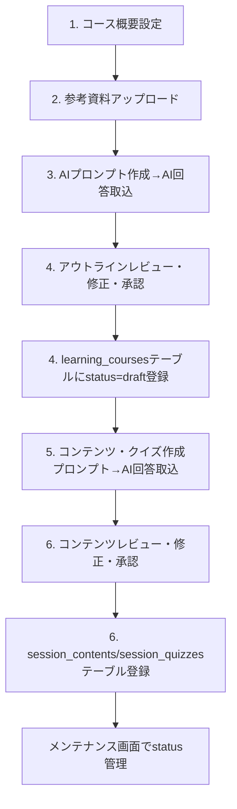

# AI生成コースシステム設計書

**プロジェクト**: AI Learning Platform - AIコース生成機能  
**作成日**: 2025年11月28日  
**バージョン**: 1.0

---

## 📋 **概要**

既存のコース学習システムにAI生成機能を統合し、参考資料（PDF、URL）から自動的に構造化されたコースコンテンツとクイズを生成するシステムです。

### **主要機能**
- 参考資料の自動解析・構造化
- コースアウトライン自動生成
- 詳細コンテンツ・クイズ自動生成
- 段階的レビュー・編集機能
- 既存学習記録・分析システムとの完全統合
- ナレッジカード・修了証バッジの自動生成

---

## 🗄️ **既存データベース構造理解**

### **コース階層構造（マスタデータ）**

```sql
-- コース情報
learning_courses
├─ id (course_id として参照される)
├─ title, description
└─ badge_data (Json) -- 修了証バッジデータ

-- ジャンル（コースの大分類）
learning_genres  
├─ id, course_id, title, description
├─ category_id    -- ★ 分析用カテゴリ連携
├─ subcategory_id -- ★ 分析用サブカテゴリ連携
└─ display_order, estimated_days

-- テーマ（ジャンル内の章）
learning_themes
├─ id, genre_id, title, description
├─ display_order, estimated_minutes
└─ reward_card_data (Json) -- ナレッジカードデータ

-- セッション（テーマ内の個別学習単位）
learning_sessions
├─ id, theme_id, title
├─ session_type, display_order
└─ estimated_minutes
```

### **コンテンツ・クイズデータ**

```sql
-- セッション別学習コンテンツ
session_contents
├─ session_id
├─ content_type -- 'text' | 'image' | 'video' | 'exercise'
└─ content_data (Json) -- コンテンツの実データ

-- セッション別確認クイズ（独立システム）
session_quizzes
├─ session_id, question, options[]
├─ correct_answer, explanation
└─ quiz_questionsテーブルとは独立
```

### **学習記録・完了管理**

```sql
-- セッション完了記録
course_session_completions
├─ user_id, course_id, genre_id, theme_id, session_id
├─ category_id, subcategory_id -- ★ 分析用
├─ completion_time, earned_xp
└─ session_quiz_correct

-- テーマ完了記録 → ナレッジカード付与
course_theme_completions
└─ 完了時にlearning_themes.reward_card_dataを付与

-- コース完了記録 → 修了証バッジ付与
course_completions  
└─ 完了時にlearning_courses.badge_data（有効期限付き）を付与

-- クイズ回答記録（分析システム統合）
quiz_answers
└─ コース学習のクイズ回答も記録される
```

---

## 🤖 **AI生成システム設計**

### **1. 生成フロー（要件準拠）**



### **2. AI生成データ構造**

```typescript
interface AIGeneratedCourse {
  // learning_courses への変換対象
  course: {
    title: string
    description: string
    estimatedDays: number
    difficulty: 'beginner' | 'basic' | 'intermediate' | 'advanced' | 'expert'
    badge_data: Json  // AI生成修了証バッジ
  }
  
  // learning_genres への変換対象
  genres: Array<{
    title: string
    description: string
    categoryId: string      // ★ 必須: 既存カテゴリとの紐付け
    subcategoryId?: string  // ★ 重要: 既存サブカテゴリとの紐付け
    estimatedDays: number
    
    // learning_themes への変換対象
    themes: Array<{
      title: string
      description: string
      estimatedMinutes: number
      reward_card_data: Json  // AI生成ナレッジカード
      
      // learning_sessions への変換対象
      sessions: Array<{
        title: string
        sessionType: 'content' | 'quiz' | 'exercise'
        estimatedMinutes: number
        
        // session_contents への変換対象
        contents: Array<{
          content_type: 'text' | 'image' | 'video' | 'exercise'
          content_data: Json
          display_order: number
        }>
        
        // session_quizzes への変換対象
        quizzes: Array<{
          question: string
          options: string[]
          correct_answer: number
          explanation: string
          display_order: number
        }>
      }>
    }>
  }>
}
```

### **3. 段階的レビューフロー**

#### **ワークフロー状態管理**

```typescript
interface CourseGenerationWorkflow {
  id: string
  user_id: string
  status: 'source_analysis' | 'outline_draft' | 'manual_input_required' | 
          'outline_approved' | 'content_draft' | 'content_approved' | 'published'
  
  // 参考資料
  sources: Array<{
    type: 'pdf' | 'url' | 'text'
    content: string | File
    priority: number
    analysis_result?: Json
  }>
  
  // 段階1: アウトライン生成・レビュー
  outline: {
    course: CourseOutline
    genres: GenreOutline[]
    themes: ThemeOutline[]
    sessions: SessionOutline[]
    category_mappings: CategoryMapping[]  // カテゴリ選択状況
    review_notes?: string
    approved: boolean
  }
  
  // 段階2: 詳細コンテンツ・クイズ生成・レビュー
  content: {
    session_contents: ContentData[]
    session_quizzes: QuizData[]
    reward_cards: Json[]
    completion_badge: Json
    review_notes?: string
    approved: boolean
  }
  
  created_at: string
  updated_at: string
}
```

#### **カテゴリ統合戦略**

```typescript
interface CategoryMapping {
  genre_id: string
  selected_category_id: string
  selected_subcategory_id?: string
  confidence_score: number  // AI推定の信頼度
  manual_override: boolean  // 手動選択されたかどうか
}

// AI生成時のカテゴリ自動提案
interface CategorySuggestion {
  recommended_category_id: string
  recommended_subcategory_id?: string
  confidence: number
  reasoning: string  // 提案理由
  alternatives: Array<{
    category_id: string
    subcategory_id?: string
    confidence: number
  }>
}
```

---

## 🏗️ **システム実装設計**

### **Phase 1: 基盤実装** (2-3週間)

#### **1.1 データベース拡張**

```sql
-- AI生成ワークフロー管理
CREATE TABLE ai_course_workflows (
  id uuid PRIMARY KEY DEFAULT gen_random_uuid(),
  user_id uuid REFERENCES auth.users(id) NOT NULL,
  title varchar(255) NOT NULL,
  description text,
  status text NOT NULL CHECK (status IN (
    'source_analysis', 'outline_draft', 'manual_input_required',
    'outline_approved', 'content_draft', 'content_approved', 'published'
  )),
  
  -- 参考資料情報
  source_materials jsonb DEFAULT '[]'::jsonb,
  
  -- 生成データ
  outline_data jsonb,
  content_data jsonb,
  category_mappings jsonb DEFAULT '[]'::jsonb,
  
  -- レビュー情報
  outline_review_notes text,
  content_review_notes text,
  
  -- AI生成設定
  generation_preferences jsonb DEFAULT '{
    "depth": "standard",
    "style": "practical", 
    "include_quizzes": true,
    "sections_count": null
  }'::jsonb,
  
  created_at timestamptz DEFAULT now(),
  updated_at timestamptz DEFAULT now()
);

-- RLS設定
ALTER TABLE ai_course_workflows ENABLE ROW LEVEL SECURITY;
CREATE POLICY "Users can only access their own workflows" 
  ON ai_course_workflows FOR ALL 
  USING (auth.uid() = user_id);
```

#### **1.2 ファイルアップロード機能**

```typescript
// /app/api/ai-course-generation/upload-sources/route.ts
export async function POST(request: NextRequest) {
  const formData = await request.formData()
  
  // PDF解析
  if (file.type === 'application/pdf') {
    const extractedText = await extractPDFContent(file)
    return { type: 'pdf', content: extractedText }
  }
  
  // URL取得
  if (sourceType === 'url') {
    const webContent = await fetchURLContent(url)
    return { type: 'url', content: webContent }
  }
  
  // テキスト直接入力
  return { type: 'text', content: textInput }
}
```

#### **1.3 AI統合基盤（手動/API両対応）**

```typescript
// /lib/ai-course-generation/ai-engine.ts
export class CourseGenerationAI {
  private mode: 'manual' | 'api'
  
  constructor(mode: 'manual' | 'api' = 'manual') {
    this.mode = mode
  }
  
  async analyzeSources(sources: SourceMaterial[]): Promise<AnalysisResult> {
    const prompt = this.buildSourceAnalysisPrompt(sources)
    
    if (this.mode === 'manual') {
      return await this.handleManualGeneration('source_analysis', prompt)
    } else {
      return await this.callAI(prompt)
    }
  }
  
  async generateOutline(
    analysis: AnalysisResult,
    preferences: GenerationPreferences,
    availableCategories: Category[]
  ): Promise<CourseOutline> {
    const prompt = this.buildOutlinePrompt(analysis, preferences, availableCategories)
    
    if (this.mode === 'manual') {
      return await this.handleManualGeneration('outline_generation', prompt)
    } else {
      return await this.callAI(prompt)
    }
  }
  
  // 手動生成モード: プロンプト提示 + 結果入力UI
  private async handleManualGeneration(
    step: string, 
    prompt: string
  ): Promise<any> {
    // ワークフローを「手動入力待ち」状態に設定
    await this.setWorkflowStatus('manual_input_required', {
      step,
      prompt,
      prompt_id: generateUniqueId()
    })
    
    // フロントエンドで手動入力を促す
    throw new ManualInputRequiredError({
      step,
      prompt,
      message: 'AI生成結果の手動入力が必要です'
    })
  }
  
  // 手動入力結果の処理
  async submitManualResult(
    workflowId: string,
    promptId: string,
    result: string
  ): Promise<any> {
    try {
      // JSON形式での結果をパース・検証
      const parsedResult = JSON.parse(result)
      await this.validateGenerationResult(parsedResult)
      
      return parsedResult
    } catch (error) {
      throw new ValidationError('生成結果の形式が正しくありません')
    }
  }
  
  // プロンプト構築メソッド
  private buildSourceAnalysisPrompt(sources: SourceMaterial[]): string {
    return `
# コース生成: 参考資料分析

## 参考資料
${sources.map((s, i) => `
### 資料 ${i + 1}: ${s.type}
${s.content}
`).join('\n')}

## 出力指示
以下のJSON形式で分析結果を出力してください：

\`\`\`json
{
  "course_title": "適切なコースタイトル",
  "target_audience": "対象学習者（例：初心者、中級者等）",
  "estimated_total_hours": 20,
  "difficulty": "beginner|basic|intermediate|advanced|expert",
  "main_topics": ["トピック1", "トピック2", "トピック3"],
  "recommended_categories": [
    {
      "category_name": "カテゴリ名",
      "subcategory_name": "サブカテゴリ名（任意）",
      "confidence": 0.9,
      "reasoning": "選択理由"
    }
  ],
  "course_description": "コースの詳細説明"
}
\`\`\`
    `
  }
  
  private buildOutlinePrompt(
    analysis: AnalysisResult,
    preferences: GenerationPreferences,
    availableCategories: Category[]
  ): string {
    return `
# コース生成: アウトライン作成

## 基本情報
- タイトル: ${analysis.course_title}
- 対象者: ${analysis.target_audience}
- 総学習時間: ${analysis.estimated_total_hours}時間
- 難易度: ${analysis.difficulty}

## 利用可能カテゴリ
${availableCategories.map(cat => 
  `- ${cat.name}: ${cat.description}`
).join('\n')}

## 生成設定
- 深度: ${preferences.depth}
- スタイル: ${preferences.style}
- クイズ含む: ${preferences.include_quizzes}

## 出力指示
以下の階層構造でJSON形式のアウトラインを生成してください：

\`\`\`json
{
  "course": {
    "title": "${analysis.course_title}",
    "description": "詳細説明",
    "estimated_days": 10,
    "difficulty": "${analysis.difficulty}"
  },
  "genres": [
    {
      "id": "genre_1",
      "title": "ジャンル1",
      "description": "ジャンルの説明",
      "suggested_category_id": "選択されたカテゴリID",
      "suggested_subcategory_id": "選択されたサブカテゴリID（任意）",
      "estimated_days": 3,
      "themes": [
        {
          "id": "theme_1",
          "title": "テーマ1",
          "description": "テーマの説明",
          "estimated_minutes": 60,
          "sessions": [
            {
              "id": "session_1",
              "title": "セッション1",
              "description": "セッションの説明",
              "session_type": "content",
              "estimated_minutes": 20
            }
          ]
        }
      ]
    }
  ]
}
\`\`\`
    `
  }
}
```

### **Phase 2: レビューUI実装** (3-4週間)

#### **2.1 コース作成ウィザード**

```tsx
// /components/ai-course-generation/CourseWizard.tsx
export function CourseWizard() {
  const [currentStep, setCurrentStep] = useState(0)
  const [workflow, setWorkflow] = useState<CourseGenerationWorkflow>()
  
  const steps = [
    'コース概要設定',
    '参考資料アップロード',
    'AIアウトライン確認',
    'カテゴリマッピング',
    'コンテンツ生成',
    '最終レビュー'
  ]
  
  return (
    <div className="container mx-auto py-6">
      <StepIndicator steps={steps} currentStep={currentStep} />
      
      {currentStep === 0 && <CourseSetupStep />}
      {currentStep === 1 && <SourceUploadStep />}
      {currentStep === 2 && <OutlineReviewStep />}
      {currentStep === 3 && <CategoryMappingStep />}
      {currentStep === 4 && <ContentGenerationStep />}
      {currentStep === 5 && <FinalReviewStep />}
    </div>
  )
}
```

#### **2.2 手動AI入力UI**

```tsx
// /components/ai-course-generation/ManualPromptInput.tsx
export function ManualPromptInput({ 
  workflow, 
  currentPrompt, 
  onSubmit 
}: {
  workflow: CourseGenerationWorkflow
  currentPrompt: string
  onSubmit: (result: string) => void
}) {
  const [aiResult, setAiResult] = useState('')
  const [isValidating, setIsValidating] = useState(false)

  const validateAndSubmit = async () => {
    setIsValidating(true)
    try {
      // JSON形式検証
      const parsed = JSON.parse(aiResult)
      await onSubmit(aiResult)
      
    } catch (error) {
      toast({
        title: "入力エラー",
        description: "有効なJSON形式で入力してください",
        variant: "destructive"
      })
    } finally {
      setIsValidating(false)
    }
  }

  return (
    <div className="grid grid-cols-1 lg:grid-cols-2 gap-6 h-screen">
      
      {/* プロンプト表示エリア */}
      <div className="space-y-4">
        <Card>
          <CardHeader>
            <CardTitle className="flex items-center gap-2">
              <Brain className="h-5 w-5" />
              Claude用プロンプト
            </CardTitle>
            <CardDescription>
              以下のプロンプトをClaude AIに送信し、結果を右側に貼り付けてください
            </CardDescription>
          </CardHeader>
          <CardContent>
            <div className="relative">
              <pre className="whitespace-pre-wrap text-sm bg-gray-50 p-4 rounded border overflow-auto max-h-96">
                {currentPrompt}
              </pre>
              
              <Button
                variant="outline"
                size="sm"
                className="absolute top-2 right-2"
                onClick={() => navigator.clipboard.writeText(currentPrompt)}
              >
                <Copy className="h-4 w-4 mr-1" />
                コピー
              </Button>
            </div>
          </CardContent>
        </Card>

        <Card>
          <CardHeader>
            <CardTitle>手順</CardTitle>
          </CardHeader>
          <CardContent className="space-y-2">
            <div className="flex items-center gap-2 text-sm">
              <div className="w-6 h-6 bg-blue-500 text-white rounded-full flex items-center justify-center text-xs">1</div>
              上記プロンプトをコピー
            </div>
            <div className="flex items-center gap-2 text-sm">
              <div className="w-6 h-6 bg-blue-500 text-white rounded-full flex items-center justify-center text-xs">2</div>
              Claude AIに送信
            </div>
            <div className="flex items-center gap-2 text-sm">
              <div className="w-6 h-6 bg-blue-500 text-white rounded-full flex items-center justify-center text-xs">3</div>
              生成結果を右側に貼り付け
            </div>
          </CardContent>
        </Card>
      </div>
      
      {/* 結果入力エリア */}
      <div className="space-y-4">
        <Card>
          <CardHeader>
            <CardTitle>AI生成結果</CardTitle>
            <CardDescription>
              Claude AIから受け取ったJSON形式の結果を貼り付けてください
            </CardDescription>
          </CardHeader>
          <CardContent className="space-y-4">
            <Textarea
              placeholder="Claude AIの生成結果をここに貼り付け..."
              value={aiResult}
              onChange={(e) => setAiResult(e.target.value)}
              className="min-h-96 font-mono text-sm"
            />
            
            <div className="flex justify-between items-center">
              <div className="text-sm text-gray-500">
                {aiResult && (
                  <>
                    文字数: {aiResult.length} | 
                    JSON有効性: {isValidJSON(aiResult) ? '✅ 有効' : '❌ 無効'}
                  </>
                )}
              </div>
              
              <Button 
                onClick={validateAndSubmit}
                disabled={!aiResult || !isValidJSON(aiResult) || isValidating}
                className="w-32"
              >
                {isValidating && <Loader2 className="h-4 w-4 mr-2 animate-spin" />}
                次のステップ
              </Button>
            </div>
          </CardContent>
        </Card>

        {/* プレビュー */}
        {isValidJSON(aiResult) && (
          <Card>
            <CardHeader>
              <CardTitle className="text-sm">プレビュー</CardTitle>
            </CardHeader>
            <CardContent>
              <JsonPreview data={JSON.parse(aiResult)} />
            </CardContent>
          </Card>
        )}
      </div>
    </div>
  )
}

function isValidJSON(str: string): boolean {
  try {
    JSON.parse(str)
    return true
  } catch {
    return false
  }
}
```

#### **2.3 アウトラインレビューエディタ**

```tsx
// /components/ai-course-generation/OutlineReview.tsx
export function OutlineReviewStep() {
  return (
    <div className="grid grid-cols-1 lg:grid-cols-3 gap-6">
      
      {/* メインエディタエリア */}
      <div className="lg:col-span-2 space-y-6">
        <OutlineTreeEditor 
          outline={workflow.outline}
          onUpdate={updateOutline}
        />
        
        <CategoryMappingEditor 
          genres={workflow.outline.genres}
          availableCategories={categories}
          availableSubcategories={subcategories}
          mappings={workflow.category_mappings}
          onMappingChange={updateCategoryMappings}
        />
      </div>
      
      {/* サイドパネル */}
      <div className="space-y-4">
        <ReviewPanel 
          onApprove={() => approveOutline()}
          onReject={() => rejectOutline()}
          notes={workflow.outline.review_notes}
          onNotesChange={updateReviewNotes}
        />
        
        <CategoryMappingPreview 
          mappings={workflow.category_mappings}
          categories={categories}
        />
        
        <AIRegeneratePanel 
          onRegenerate={() => regenerateOutline()}
          loading={isRegenerating}
        />
      </div>
    </div>
  )
}
```

### **Phase 3: AI生成エンジン** (3-4週間)

#### **3.1 API実装**

```typescript
// /app/api/ai-course-generation/
├── workflows/
│   ├── route.ts              // ワークフロー CRUD
│   └── [id]/
│       ├── route.ts          // 個別ワークフロー操作
│       ├── analyze/route.ts  // 参考資料解析
│       ├── outline/route.ts  // アウトライン生成
│       ├── content/route.ts  // コンテンツ生成
│       └── publish/route.ts  // コース公開
├── upload-sources/route.ts   // ファイルアップロード
└── categories/suggestions/route.ts  // カテゴリ提案
```

#### **3.2 コンテンツ生成エンジン**

```typescript
// /lib/ai-course-generation/content-generator.ts
export class ContentGenerator {
  
  async generateSessionContent(
    session: SessionOutline,
    sources: SourceMaterial[]
  ): Promise<SessionContent[]> {
    
    const contents: SessionContent[] = []
    
    // テキストコンテンツ生成
    const textContent = await this.generateTextContent(session, sources)
    contents.push({
      content_type: 'text',
      content_data: { 
        markdown: textContent.markdown,
        sections: textContent.sections,
        key_points: textContent.keyPoints
      },
      display_order: 1
    })
    
    // 演習問題生成
    const exercises = await this.generateExercises(session, sources)
    contents.push({
      content_type: 'exercise',
      content_data: {
        type: 'practice',
        exercises: exercises,
        difficulty: session.difficulty
      },
      display_order: 2
    })
    
    return contents
  }
  
  async generateSessionQuizzes(
    session: SessionOutline,
    content: SessionContent[]
  ): Promise<SessionQuiz[]> {
    
    const prompt = `
    以下の学習コンテンツに基づいて、理解度確認クイズを生成してください。
    
    【セッション情報】
    タイトル: ${session.title}
    説明: ${session.description}
    
    【学習コンテンツ】
    ${content.map(c => c.content_data).join('\n\n')}
    
    【要件】
    - 3-5問の選択式問題
    - 各問題に詳細な解説を含める
    - 難易度は${session.difficulty}レベル
    `
    
    return await this.generateQuizzes(prompt)
  }
  
  async generateRewardCard(
    theme: ThemeOutline,
    completedSessions: SessionOutline[]
  ): Promise<Json> {
    
    return {
      type: 'knowledge_card',
      title: `${theme.title}修了`,
      description: `${theme.title}の学習を完了しました`,
      achievement_data: {
        sessions_completed: completedSessions.length,
        key_learnings: await this.extractKeyLearnings(completedSessions),
        next_recommendations: await this.generateNextSteps(theme)
      },
      visual_data: {
        icon: await this.generateCardIcon(theme),
        color_scheme: await this.selectColorScheme(theme),
        background_pattern: 'achievement'
      },
      created_at: new Date().toISOString()
    }
  }
}
```

### **Phase 4: 既存システム統合** (2-3週間)

#### **4.1 データベース変換・保存**

```typescript
// /lib/ai-course-generation/course-publisher.ts
export class CoursePublisher {
  
  async publishCourse(
    workflow: CourseGenerationWorkflow
  ): Promise<{ courseId: string; success: boolean }> {
    
    const supabaseAdmin = createClient(/* admin config */)
    
    try {
      await supabaseAdmin.rpc('begin_transaction')
      
      // 1. learning_courses 作成
      const { data: course } = await supabaseAdmin
        .from('learning_courses')
        .insert({
          title: workflow.outline.course.title,
          description: workflow.outline.course.description,
          difficulty: workflow.outline.course.difficulty,
          badge_data: workflow.content.completion_badge,
          estimated_days: workflow.outline.course.estimatedDays,
          created_by: workflow.user_id
        })
        .select('id')
        .single()
      
      // 2. learning_genres 作成 (カテゴリマッピング適用)
      for (const [index, genre] of workflow.outline.genres.entries()) {
        const mapping = workflow.category_mappings.find(m => m.genre_id === genre.id)
        
        const { data: genreData } = await supabaseAdmin
          .from('learning_genres')
          .insert({
            course_id: course.id,
            title: genre.title,
            description: genre.description,
            category_id: mapping?.selected_category_id || genre.suggested_category_id,
            subcategory_id: mapping?.selected_subcategory_id || genre.suggested_subcategory_id,
            display_order: index + 1,
            estimated_days: genre.estimatedDays
          })
          .select('id')
          .single()
        
        // 3. learning_themes 作成
        await this.createThemes(genreData.id, genre.themes)
      }
      
      await supabaseAdmin.rpc('commit_transaction')
      return { courseId: course.id, success: true }
      
    } catch (error) {
      await supabaseAdmin.rpc('rollback_transaction')
      throw error
    }
  }
  
  private async createThemes(genreId: string, themes: ThemeOutline[]) {
    // learning_themes, learning_sessions, session_contents, session_quizzes 作成
  }
}
```

#### **4.2 学習記録システム統合**

```typescript
// 既存の学習完了処理に統合
// /app/api/xp-save/course/route.ts に AI生成コース対応を追加

export async function POST(request: NextRequest) {
  // ... 既存の処理
  
  // AI生成コースも同様に処理
  const { data: completionData } = await supabaseAdmin
    .from('course_session_completions')
    .insert({
      user_id: userId,
      course_id: courseId,
      genre_id: genreId,
      theme_id: themeId,
      session_id: sessionId,
      category_id: categoryId,      // ★ AI生成時に設定されたカテゴリ
      subcategory_id: subcategoryId, // ★ AI生成時に設定されたサブカテゴリ
      completion_time: new Date().toISOString(),
      earned_xp: calculatedXP,
      session_quiz_correct: quizResults.allCorrect
    })
  
  // 既存の分析システムで自動追跡される
}
```

---

## 🔄 **開発フロー・マイルストーン**

### **Sprint 1 (Week 1-2): 基盤構築** ✅ **完了**
- [x] データベーススキーマ設計・作成
- [x] ファイルアップロード機能  
- [x] AI統合基盤（手動モード完了、APIモード枠組み準備済み）
- [x] 基本的なワークフロー管理

### **Sprint 2 (Week 3-4): アウトライン生成** 🟡 **部分完了**
- [x] 参考資料解析エンジン
- [x] アウトライン生成AI（手動モード）
- [x] アウトラインレビューUI基盤
- [ ] **learning_coursesテーブル投入機能**
- [ ] **Claude API統合（APIモード実装）**
- [ ] **モード切替UI実装**

### **Sprint 3 (Week 5-6): コンテンツ生成**
- [ ] セッションコンテンツ生成
- [ ] クイズ自動生成
- [ ] ナレッジカード生成
- [ ] 修了証バッジ生成
- [ ] **session_contents/session_quizzesテーブル投入**

### **Sprint 4 (Week 7-8): コース管理・メンテナンス** 🔥 **新規追加（要件準拠）**
- [ ] **コース一覧表示（status別フィルタ）**
- [ ] **コース学習データ修正機能**
- [ ] **status変更機能（draft→coming_soon→available→archived）**
- [ ] **管理者用メンテナンス画面**
- [ ] **既存コース学習画面との統合テスト**

### **Sprint 5 (Week 9-10): 統合・最適化**
- [ ] パフォーマンス最適化
- [ ] エラーハンドリング強化
- [ ] 本格運用準備

---

## 🎯 **期待される効果**

### **immediate Benefits**
- **コース作成時間**: 数週間 → 数時間に短縮
- **一貫性のある品質**: AI生成による標準化
- **スケーラブルなコンテンツ**: 大量コース対応

### **Long-term Value**  
- **動的更新**: 参考資料更新時の自動反映
- **パーソナライズ学習**: 個人最適化コース
- **企業向けカスタムコース**: 業界特化対応
- **学習効果分析**: カテゴリ別詳細分析継続

### **Technical Benefits**
- **既存システム活用**: 学習記録・分析システム完全統合
- **拡張性**: 新しいcontent_type追加容易
- **保守性**: 段階的レビューによる品質保証

---

## 📚 **参考資料・技術スタック**

### **AI/ML**
- **手動モード**: Claude Web Interface（手動プロンプト実行）
- **APIモード**: Claude API (アンソロピック) - 後日導入
- PDF解析: pdf-parse
- Web取得: cheerio + playwright

### **フロントエンド**
- Next.js 15.5.2
- React Hook Form
- TailwindCSS + shadcn/ui
- React DnD (ドラッグ&ドロップ)

### **バックエンド**  
- Supabase (PostgreSQL + RLS)
- Next.js API Routes
- TypeScript

### **ファイル処理**
- Vercel Blob Storage
- Sharp (画像処理)
- FFmpeg (動画処理)

---

**📝 この設計書は実装進捗に応じて更新されます**