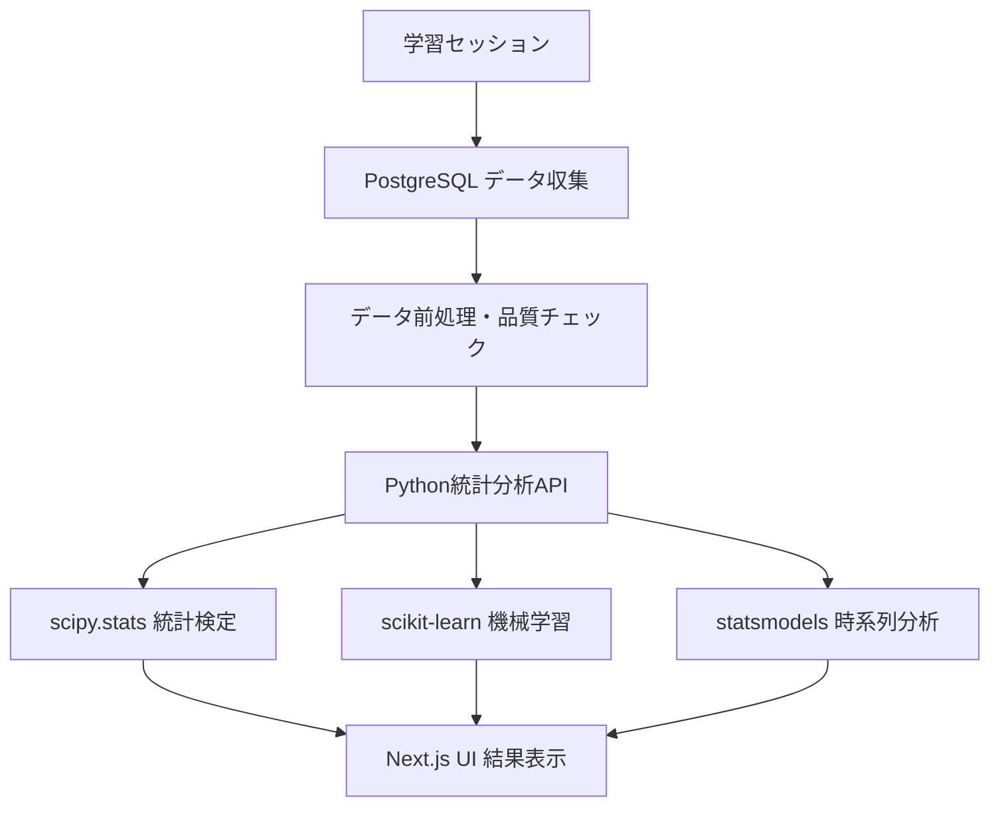

# AI学習分析システム 統計実装戦略・設計書

**プロジェクト**: AI Learning Platform Next.js  
**目的**: 科学的根拠に基づく学習パーソナライゼーション実現  
**作成日**: 2025年10月2日  
**ステータス**: 実装戦略確定、第一選択肢実装開始準備完了

---

## 📋 **要件定義**

### **科学的AI学習分析の必須要件**

#### **1. 学習頻度分析 (analyzeLearningFrequency)**
**要件**:
- 日別問題数（クイズの各問題数 + コース学習セッション確認問題数）
- 活動日数、曜日別パターン
- **高度分析**: その日の解答問題数と翌日の関係性（継続性、バーンアウト検出）
- **統計的要求**: 継続性と解答数の相関性分析、有効性判定のためのデータ蓄積要件

#### **2. 時間パターン分析 (analyzeTimePatterns)**
**要件**:
- 時間別活動量と正答率の組み合わせ分析
- **ビジネスマン特化**: 早朝通勤、昼休み、夕方通勤、夜間個人時間別最適化
- **統計的要求**: 一定期間での学習傾向として特定時間帯での一貫した良好/不良パフォーマンス検出
- **科学的根拠**: 統計的有意性検定による傾向判定

#### **3. 科目別強み分析 (analyzeSubjectStrengths)**
**要件**:
- カテゴリー別、サブカテゴリー別の正答率分析
- **高度分析**: 正解時vs不正解時の回答時間相関性分析（確信度パターン検出）
- **統合評価**: 正答率×XP×回答時間すべてが高い傾向を強みとする科学的判定
- **統計的要求**: 継続的傾向として強み・弱み判定に必要なデータ量の科学的見極め

#### **4. 難易度進捗分析 (analyzeDifficultyProgression)**
**要件**:
- クイズ問題難易度と正答率の関係分析
- **統合分析**: コース学習の難易度とセッションクイズ正答率の統合評価
- **個人化**: サブカテゴリー別XP、カテゴリー別XPと正答率の学習成長性評価
- **適性評価**: ユーザープロフィール学習設定レベル（自己申告）の科学的適性評価

#### **5. 業界別分析機能**
**要件**:
- 業界選択（XP > 0の業界のみ選択表示）
- 業界レベル選択（basic/intermediate/advanced/expert）
- サブカテゴリー別レーダーチャート表示
- 各レベルの目標XPレベル比較表示
- **管理機能**: DB化した管理者変更可能なマスタデータ管理

### **科学的分析の高度要件**
- **統計的検定**: t検定、カイ二乗検定による有意性判定
- **時系列分析**: 移動平均、季節性調整、回帰分析によるトレンド検出
- **相関分析**: ピアソン相関係数の有意性検定
- **機械学習**: クラスタリングによる学習パターン発見、予測モデル

---

## 🎯 **第一選択肢: Python統計分析サービス実装**

### **選択理由**
1. **科学的精度**: scipy.stats, pandas, scikit-learnによる本格統計分析
2. **差別化要因**: 「AIによる科学的学習パーソナライゼーション」の完全実現
3. **拡張性**: 機械学習、高度な時系列分析への発展可能
4. **コスト効率**: 10名テスター期間は無料枠で対応可能

### **実現範囲定義**

#### **完全実装可能な統計機能**
```python
# 1. 本格統計検定
scipy.stats.ttest_ind()          # Welch's t-test
scipy.stats.pearsonr()           # ピアソン相関係数 + 有意性検定
scipy.stats.chi2_contingency()   # カイ二乗検定

# 2. 時系列分析
pandas.rolling()                 # 移動平均
statsmodels.seasonal_decompose() # 季節性分解
scipy.stats.linregress()        # 線形回帰トレンド

# 3. 機械学習
sklearn.cluster.KMeans()         # 学習パターンクラスタリング
sklearn.preprocessing.StandardScaler() # 特徴量正規化
sklearn.metrics.silhouette_score()     # クラスター評価

# 4. 高度な相関分析
pandas.corr()                    # 相関行列
scipy.stats.spearmanr()          # スピアマン相関（非線形関係）
```

#### **具体的実装機能**
1. **統計的有意性検定**: 時間帯別パフォーマンス差の検定（p値 < 0.05）
2. **効果量計算**: Cohen's d による実用的意義の評価
3. **信頼区間**: 95%信頼区間による推定精度の明示
4. **学習パターンクラスタリング**: 3-5パターンの学習タイプ自動分類
5. **予測モデル**: 学習継続性、成績向上の予測
6. **時系列トレンド**: 統計的に有意な改善/悪化傾向の検出

### **アーキテクチャ設計**

#### **システム構成**
```typescript
interface PythonStatisticalArchitecture {
  // Next.js メインアプリケーション
  frontend: {
    technology: "Next.js + TypeScript + React"
    responsibility: "UI表示、ユーザー操作、結果可視化"
  }
  
  // PostgreSQL（データ収集・前処理）
  database: {
    technology: "PostgreSQL + Supabase"
    responsibility: "データ収集、基本集計、前処理"
    functions: [
      "データクリーニング",
      "基本統計量計算", 
      "データ品質チェック",
      "Python API用データ整形"
    ]
  }
  
  // Python統計分析API（新規追加）
  statisticsService: {
    technology: "FastAPI + Python"
    libraries: [
      "scipy.stats (統計検定)",
      "pandas (データ処理)", 
      "numpy (数値計算)",
      "scikit-learn (機械学習)",
      "statsmodels (時系列分析)"
    ]
    deployment: "Vercel Functions (Python Runtime)"
    fallback: "Railway/Render (無料枠)"
  }
  
  // API連携
  integration: "Next.js API Routes → Python統計分析API → PostgreSQL"
}
```

#### **データフロー**


### **具体的実装設計**

#### **Python統計分析サービス**
```python
# analytics_service/main.py
from fastapi import FastAPI, HTTPException
from scipy import stats
import pandas as pd
import numpy as np
from sklearn.cluster import KMeans
from sklearn.preprocessing import StandardScaler
from statsmodels.tsa.seasonal import seasonal_decompose
import logging

app = FastAPI(
    title="AI Learning Statistical Analysis Service",
    description="科学的学習分析のための統計計算API",
    version="1.0.0"
)

@app.post("/analyze/time-pattern-significance")
async def analyze_time_pattern_significance(data: dict):
    """時間帯別パフォーマンスの統計的有意性検定"""
    try:
        morning_accuracies = np.array(data['morning_accuracies'])
        evening_accuracies = np.array(data['evening_accuracies'])
        
        # Welch's t-test（等分散を仮定しない）
        t_stat, p_value = stats.ttest_ind(
            morning_accuracies, 
            evening_accuracies, 
            equal_var=False
        )
        
        # Effect size (Cohen's d)
        pooled_std = np.sqrt(
            ((len(morning_accuracies) - 1) * np.var(morning_accuracies, ddof=1) + 
             (len(evening_accuracies) - 1) * np.var(evening_accuracies, ddof=1)) / 
            (len(morning_accuracies) + len(evening_accuracies) - 2)
        )
        cohens_d = (np.mean(morning_accuracies) - np.mean(evening_accuracies)) / pooled_std
        
        # 信頼区間計算
        confidence_interval = stats.t.interval(
            0.95, 
            len(morning_accuracies) + len(evening_accuracies) - 2,
            np.mean(morning_accuracies) - np.mean(evening_accuracies),
            pooled_std * np.sqrt(1/len(morning_accuracies) + 1/len(evening_accuracies))
        )
        
        return {
            "analysis_type": "time_pattern_significance",
            "t_statistic": float(t_stat),
            "p_value": float(p_value),
            "is_significant": p_value < 0.05,
            "effect_size": float(cohens_d),
            "effect_interpretation": interpret_cohens_d(cohens_d),
            "confidence_interval_95": confidence_interval,
            "sample_sizes": {
                "morning": len(morning_accuracies),
                "evening": len(evening_accuracies)
            },
            "descriptive_stats": {
                "morning_mean": float(np.mean(morning_accuracies)),
                "evening_mean": float(np.mean(evening_accuracies)),
                "morning_std": float(np.std(morning_accuracies, ddof=1)),
                "evening_std": float(np.std(evening_accuracies, ddof=1))
            }
        }
    except Exception as e:
        logging.error(f"Time pattern analysis error: {e}")
        raise HTTPException(status_code=500, detail=str(e))

@app.post("/analyze/learning-frequency-correlation")
async def analyze_learning_frequency_correlation(data: dict):
    """学習頻度と継続性の相関分析"""
    daily_questions = np.array(data['daily_question_counts'])
    next_day_continuation = np.array(data['next_day_continued'])  # 0 or 1
    
    # ピアソン相関係数と有意性検定
    correlation, p_value = stats.pearsonr(daily_questions, next_day_continuation)
    
    # スピアマン相関（非線形関係も検出）
    spearman_corr, spearman_p = stats.spearmanr(daily_questions, next_day_continuation)
    
    return {
        "analysis_type": "frequency_continuation_correlation",
        "pearson_correlation": float(correlation),
        "pearson_p_value": float(p_value),
        "spearman_correlation": float(spearman_corr),
        "spearman_p_value": float(spearman_p),
        "is_significant_pearson": p_value < 0.05,
        "is_significant_spearman": spearman_p < 0.05,
        "sample_size": len(daily_questions),
        "interpretation": generate_correlation_interpretation(correlation, p_value)
    }

@app.post("/analyze/subject-response-time-patterns")
async def analyze_subject_response_time_patterns(data: dict):
    """正解/不正解時の回答時間パターン分析"""
    correct_times = np.array(data['correct_response_times'])
    incorrect_times = np.array(data['incorrect_response_times'])
    
    # 分布の正規性検定
    correct_normality = stats.normaltest(correct_times)
    incorrect_normality = stats.normaltest(incorrect_times)
    
    # Mann-Whitney U検定（非パラメトリック）
    u_stat, mann_whitney_p = stats.mannwhitneyu(
        correct_times, incorrect_times, alternative='two-sided'
    )
    
    # Welch's t-test
    t_stat, t_test_p = stats.ttest_ind(correct_times, incorrect_times, equal_var=False)
    
    return {
        "analysis_type": "response_time_pattern_analysis",
        "correct_times_stats": {
            "mean": float(np.mean(correct_times)),
            "median": float(np.median(correct_times)),
            "std": float(np.std(correct_times, ddof=1)),
            "is_normal": correct_normality.pvalue > 0.05
        },
        "incorrect_times_stats": {
            "mean": float(np.mean(incorrect_times)),
            "median": float(np.median(incorrect_times)),
            "std": float(np.std(incorrect_times, ddof=1)),
            "is_normal": incorrect_normality.pvalue > 0.05
        },
        "mann_whitney_u": {
            "statistic": float(u_stat),
            "p_value": float(mann_whitney_p),
            "is_significant": mann_whitney_p < 0.05
        },
        "t_test": {
            "statistic": float(t_stat),
            "p_value": float(t_test_p),
            "is_significant": t_test_p < 0.05
        },
        "confidence_pattern": classify_response_pattern(correct_times, incorrect_times)
    }

@app.post("/analyze/learning-patterns-clustering")
async def analyze_learning_patterns_clustering(data: dict):
    """機械学習による学習パターンクラスタリング"""
    features = np.array(data['features'])  # [time_of_day, accuracy, response_time, frequency, etc.]
    feature_names = data['feature_names']
    
    # 特徴量正規化
    scaler = StandardScaler()
    features_scaled = scaler.fit_transform(features)
    
    # 最適クラスター数の決定（エルボー法 + シルエット分析）
    optimal_clusters = find_optimal_clusters(features_scaled)
    
    # KMeansクラスタリング
    kmeans = KMeans(n_clusters=optimal_clusters, random_state=42, n_init=10)
    clusters = kmeans.fit_predict(features_scaled)
    
    # クラスター特性分析
    cluster_characteristics = analyze_cluster_characteristics(
        features, clusters, feature_names
    )
    
    return {
        "analysis_type": "learning_pattern_clustering",
        "optimal_cluster_count": optimal_clusters,
        "cluster_assignments": clusters.tolist(),
        "cluster_centers": kmeans.cluster_centers_.tolist(),
        "cluster_characteristics": cluster_characteristics,
        "silhouette_score": float(
            silhouette_score(features_scaled, clusters)
        ),
        "learning_insights": generate_learning_insights(cluster_characteristics)
    }

@app.post("/analyze/time-series-trend")
async def analyze_time_series_trend(data: dict):
    """時系列トレンド分析（季節性分解）"""
    dates = pd.to_datetime(data['dates'])
    values = np.array(data['performance_values'])
    
    # 時系列データ作成
    ts = pd.Series(values, index=dates)
    
    # 欠損データの処理
    ts = ts.interpolate(method='linear')
    
    # 季節性分解（週次パターン）
    decomposition = seasonal_decompose(
        ts, model='additive', period=7, extrapolate_trend='freq'
    )
    
    # 線形回帰トレンド
    x = np.arange(len(ts))
    slope, intercept, r_value, p_value, std_err = stats.linregress(x, ts.values)
    
    return {
        "analysis_type": "time_series_trend_analysis",
        "linear_trend": {
            "slope": float(slope),
            "intercept": float(intercept),
            "r_squared": float(r_value ** 2),
            "p_value": float(p_value),
            "is_significant_trend": p_value < 0.05,
            "trend_interpretation": interpret_trend(slope, p_value)
        },
        "seasonal_decomposition": {
            "trend": decomposition.trend.dropna().tolist(),
            "seasonal": decomposition.seasonal.dropna().tolist(),
            "residual": decomposition.resid.dropna().tolist()
        },
        "forecasting": generate_short_term_forecast(ts, decomposition)
    }

# ヘルパー関数
def interpret_cohens_d(d):
    """Cohen's d の効果量解釈"""
    abs_d = abs(d)
    if abs_d < 0.2:
        return "negligible"
    elif abs_d < 0.5:
        return "small"
    elif abs_d < 0.8:
        return "medium"
    else:
        return "large"

def find_optimal_clusters(features):
    """最適クラスター数の決定"""
    from sklearn.metrics import silhouette_score
    
    silhouette_scores = []
    K_range = range(2, min(8, len(features)//2))
    
    for k in K_range:
        kmeans = KMeans(n_clusters=k, random_state=42)
        labels = kmeans.fit_predict(features)
        score = silhouette_score(features, labels)
        silhouette_scores.append(score)
    
    optimal_k = K_range[np.argmax(silhouette_scores)]
    return optimal_k

def classify_response_pattern(correct_times, incorrect_times):
    """回答時間パターンの分類"""
    correct_median = np.median(correct_times)
    incorrect_median = np.median(incorrect_times)
    
    if correct_median < incorrect_median * 0.8:
        return "confident_quick"      # 正解時は素早く確信を持って回答
    elif correct_median > incorrect_median * 1.2:
        return "careful_deliberate"   # 正解時は慎重に時間をかけて回答
    else:
        return "consistent_pace"      # 正解・不正解に関わらず一定ペース
```

#### **Next.js API統合**
```typescript
// app/api/analytics/advanced-statistics/route.ts
export async function POST(request: Request) {
  const body = await request.json();
  const { analysisType, data, userId } = body;
  
  try {
    // データベースからユーザーの学習データを取得
    const learningData = await collectUserLearningData(userId, data.timeRange);
    
    // Python統計分析サービスへのリクエスト
    const pythonServiceUrl = process.env.PYTHON_ANALYTICS_URL || 'http://localhost:8000';
    
    const response = await fetch(`${pythonServiceUrl}/analyze/${analysisType}`, {
      method: 'POST',
      headers: { 
        'Content-Type': 'application/json',
        'Authorization': `Bearer ${process.env.ANALYTICS_API_KEY}`
      },
      body: JSON.stringify(learningData)
    });
    
    if (!response.ok) {
      throw new Error(`Python service error: ${response.status}`);
    }
    
    const statisticalResult = await response.json();
    
    // 結果の保存（キャッシュ）
    await saveAnalysisResult(userId, analysisType, statisticalResult);
    
    return Response.json({
      ...statisticalResult,
      metadata: {
        analysis_timestamp: new Date().toISOString(),
        user_id: userId,
        data_points: learningData.sample_size,
        cache_duration: 3600 // 1時間キャッシュ
      },
      user_friendly_interpretation: generateUserInterpretation(statisticalResult)
    });
    
  } catch (error) {
    console.error('Statistical analysis error:', error);
    
    // フォールバック: 基本統計のみ提供
    const fallbackResult = await generateBasicStatistics(userId, data);
    
    return Response.json({
      ...fallbackResult,
      warning: "高度統計分析サービスが利用できません。基本分析を表示しています。",
      is_fallback: true
    });
  }
}

async function collectUserLearningData(userId: string, timeRange: any) {
  const { data: sessions } = await supabase
    .from('quiz_sessions')
    .select(`
      *,
      quiz_answers(*)
    `)
    .eq('user_id', userId)
    .gte('created_at', timeRange.start)
    .lte('created_at', timeRange.end);
  
  // Python分析用のデータ構造に変換
  return {
    morning_accuracies: extractAccuracies(sessions, 'morning'),
    evening_accuracies: extractAccuracies(sessions, 'evening'),
    daily_question_counts: calculateDailyCounts(sessions),
    next_day_continued: calculateContinuation(sessions),
    correct_response_times: extractResponseTimes(sessions, true),
    incorrect_response_times: extractResponseTimes(sessions, false),
    features: extractFeatures(sessions),
    feature_names: ['time_of_day', 'accuracy', 'response_time', 'frequency'],
    dates: sessions.map(s => s.created_at),
    performance_values: sessions.map(s => s.accuracy_rate),
    sample_size: sessions.length
  };
}
```

### **デプロイメント戦略**

#### **Vercel Functions（推奨）**
```yaml
# vercel.json
{
  "functions": {
    "api/python/statistical_analysis.py": {
      "runtime": "python3.9",
      "maxDuration": 10
    }
  },
  "env": {
    "PYTHON_ANALYTICS_URL": "https://your-project.vercel.app/api/python",
    "ANALYTICS_API_KEY": "@analytics-api-key"
  }
}
```

**制約と対応**:
- ✅ **実行時間**: 10秒制限（軽量統計分析で十分）
- ✅ **メモリ**: 1GB（pandas, scipy処理に十分）
- ✅ **コスト**: 10名テスター・3ヶ月で無料枠内
- ❌ **重い機械学習**: 別サービス（Railway）に移行

#### **Railway（フォールバック）**
```dockerfile
# Dockerfile
FROM python:3.11-slim

WORKDIR /app
COPY requirements.txt .
RUN pip install --no-cache-dir -r requirements.txt

COPY . .
EXPOSE 8000

CMD ["uvicorn", "main:app", "--host", "0.0.0.0", "--port", "8000"]
```

```txt
# requirements.txt
fastapi==0.104.1
uvicorn==0.24.0
scipy==1.11.4
pandas==2.1.3
numpy==1.25.2
scikit-learn==1.3.2
statsmodels==0.14.0
python-multipart==0.0.6
```

---

## 🔄 **第二選択肢: PostgreSQL簡易統計実装**

### **選択条件**
第一選択肢（Python）で以下の問題が発生した場合の代替案：
- Vercel Functions実行時間制限に頻繁に到達
- Python統計サービスの安定性問題
- デプロイ・運用の複雑性が許容範囲を超過
- 開発リソース制約

### **実現範囲（制限事項明記）**

#### **PostgreSQL で実装可能な機能**
```sql
-- 1. 基本統計検定（簡易版）
CREATE OR REPLACE FUNCTION simple_t_test(
  sample1_mean DECIMAL, sample1_stddev DECIMAL, sample1_size INTEGER,
  sample2_mean DECIMAL, sample2_stddev DECIMAL, sample2_size INTEGER
) RETURNS TABLE (
  t_statistic DECIMAL,
  p_value_approximation DECIMAL,
  is_significant BOOLEAN
) AS $$
DECLARE
  t_stat DECIMAL;
BEGIN
  t_stat := (sample1_mean - sample2_mean) / 
           SQRT((sample1_stddev^2 / sample1_size) + (sample2_stddev^2 / sample2_size));
  
  RETURN QUERY SELECT 
    t_stat,
    CASE 
      WHEN ABS(t_stat) > 2.576 THEN 0.01
      WHEN ABS(t_stat) > 1.96 THEN 0.05
      WHEN ABS(t_stat) > 1.645 THEN 0.10
      ELSE 0.50
    END,
    ABS(t_stat) > 1.96;
END;
$$ LANGUAGE plpgsql;

-- 2. 相関分析（PostgreSQL標準）
SELECT CORR(response_time_ms, accuracy_score) as correlation
FROM user_learning_data;

-- 3. 移動平均（ウィンドウ関数）
SELECT 
  study_date,
  accuracy_rate,
  AVG(accuracy_rate) OVER (
    ORDER BY study_date 
    ROWS BETWEEN 6 PRECEDING AND CURRENT ROW
  ) as moving_average_7day
FROM daily_performance;
```

#### **実装できない機能（PostgreSQL制約）**
- ❌ **正確なp値計算**: ベータ関数、ガンマ関数が必要
- ❌ **高度な時系列分析**: ARIMA、季節性分解
- ❌ **機械学習**: クラスタリング、分類、予測モデル
- ❌ **多変量解析**: 主成分分析、因子分析

### **PostgreSQL簡易実装設計**

#### **統計関数群**
```sql
-- 学習頻度統計分析
CREATE OR REPLACE FUNCTION analyze_learning_frequency_simple(p_user_id UUID)
RETURNS TABLE (
  daily_avg_questions DECIMAL,
  consistency_score DECIMAL,
  weekly_pattern JSONB,
  trend_direction TEXT
) AS $$
BEGIN
  RETURN QUERY
  WITH daily_stats AS (
    SELECT 
      DATE(qa.created_at) as study_date,
      COUNT(*) as question_count,
      EXTRACT(DOW FROM qa.created_at) as day_of_week
    FROM quiz_answers qa
    JOIN quiz_sessions qs ON qa.session_id = qs.id
    WHERE qs.user_id = p_user_id
      AND qa.created_at >= NOW() - INTERVAL '30 days'
    GROUP BY DATE(qa.created_at), EXTRACT(DOW FROM qa.created_at)
  )
  SELECT 
    AVG(question_count)::DECIMAL(5,1),
    CASE 
      WHEN STDDEV(question_count) / AVG(question_count) < 0.3 THEN 0.9
      WHEN STDDEV(question_count) / AVG(question_count) < 0.5 THEN 0.7
      ELSE 0.5
    END::DECIMAL(3,2),
    json_object_agg(day_of_week, AVG(question_count))::JSONB,
    CASE 
      WHEN regr_slope(question_count::DECIMAL, EXTRACT(EPOCH FROM study_date)) > 0.01 THEN 'improving'
      WHEN regr_slope(question_count::DECIMAL, EXTRACT(EPOCH FROM study_date)) < -0.01 THEN 'declining'
      ELSE 'stable'
    END
  FROM daily_stats;
END;
$$ LANGUAGE plpgsql;

-- 時間パターン簡易分析
CREATE OR REPLACE FUNCTION analyze_time_patterns_simple(p_user_id UUID)
RETURNS TABLE (
  hour_of_day INTEGER,
  avg_accuracy DECIMAL,
  performance_rank INTEGER,
  is_optimal_time BOOLEAN
) AS $$
BEGIN
  RETURN QUERY
  WITH hourly_performance AS (
    SELECT 
      EXTRACT(HOUR FROM qa.created_at)::INTEGER as hour,
      AVG(CASE WHEN qa.is_correct THEN 1.0 ELSE 0.0 END) * 100 as accuracy
    FROM quiz_answers qa
    JOIN quiz_sessions qs ON qa.session_id = qs.id
    WHERE qs.user_id = p_user_id
      AND qa.created_at >= NOW() - INTERVAL '30 days'
    GROUP BY EXTRACT(HOUR FROM qa.created_at)
    HAVING COUNT(*) >= 5
  )
  SELECT 
    hour,
    accuracy::DECIMAL(5,2),
    RANK() OVER (ORDER BY accuracy DESC)::INTEGER,
    accuracy > (SELECT AVG(accuracy) + STDDEV(accuracy) * 0.5 FROM hourly_performance)
  FROM hourly_performance
  ORDER BY hour;
END;
$$ LANGUAGE plpgsql;
```

#### **制限事項と代替アプローチ**
```typescript
interface PostgreSQLLimitations {
  statistical_tests: {
    limitation: "正確なp値計算不可"
    alternative: "閾値ベースの簡易判定（t > 1.96 で有意）"
  }
  
  machine_learning: {
    limitation: "クラスタリング不可"
    alternative: "ルールベース分類（IF-THEN ロジック）"
  }
  
  time_series: {
    limitation: "季節性分解不可"
    alternative: "移動平均・線形トレンドのみ"
  }
  
  correlation_analysis: {
    limitation: "有意性検定不可"
    alternative: "相関係数の強度による判定（|r| > 0.3）"
  }
}
```

---

## 📊 **実装戦略比較・選択基準**

### **選択肢評価マトリックス**

| 評価項目 | Python統計サービス | PostgreSQL簡易版 |
|---|---|---|
| **科学的精度** | ⭐⭐⭐⭐⭐ | ⭐⭐⭐ |
| **統計的有意性** | ✅ 完全対応 | △ 簡易判定 |
| **機械学習** | ✅ フル機能 | ❌ 不可 |
| **実装コスト** | ⭐⭐⭐ | ⭐⭐⭐⭐⭐ |
| **運用コスト** | 無料~$10/月 | $0 |
| **開発期間** | 3-4週間 | 1-2週間 |
| **技術リスク** | ⭐⭐ | ⭐⭐⭐⭐⭐ |
| **スケーラビリティ** | ⭐⭐⭐⭐⭐ | ⭐⭐ |
| **差別化効果** | ⭐⭐⭐⭐⭐ | ⭐⭐⭐ |

### **選択基準**

#### **第一選択肢採用条件**
- ✅ **科学的分析**が主要差別化要因
- ✅ **開発リソース**3-4週間確保可能
- ✅ **10名テスター**期間での検証実施
- ✅ **技術的挑戦**を受け入れ可能

#### **第二選択肢移行条件**
- ❌ Vercel Functions実行時間超過が頻発
- ❌ Python統計サービスの安定性問題
- ❌ 開発期間制約（1-2週間以内）
- ❌ 運用複雑性回避が必要

---

## 🚀 **第一選択肢実装開始準備**

### **実装フェーズ**

#### **Phase 1: 基盤構築（Week 1-2）**
1. **FastAPI統計サービス基本構造**
   - プロジェクト初期化
   - 基本的な統計関数実装
   - Vercel Functions設定

2. **Next.js API統合**
   - Python統計サービス呼び出しAPI
   - エラーハンドリング・フォールバック
   - データ前処理関数

3. **データ収集・前処理**
   - PostgreSQL データ抽出最適化
   - Python用データフォーマット変換
   - データ品質チェック

#### **Phase 2: 統計分析実装（Week 3-4）**
1. **本格統計検定**
   - t検定、相関分析
   - 効果量、信頼区間計算
   - 有意性判定

2. **時系列・トレンド分析**
   - 移動平均、季節性分解
   - 線形回帰トレンド
   - 予測機能

3. **機械学習機能**
   - 学習パターンクラスタリング
   - 最適クラスター数決定
   - 特性分析

#### **Phase 3: UI統合・テスト（Week 5-6）**
1. **結果可視化**
   - 統計結果のわかりやすい表示
   - インタラクティブチャート
   - 科学的根拠の説明

2. **10名テスター検証**
   - 分析精度検証
   - パフォーマンステスト
   - フィードバック収集

### **技術準備事項**

#### **開発環境セットアップ**
```bash
# Python統計サービス開発環境
mkdir ai-learning-statistics-service
cd ai-learning-statistics-service

# 仮想環境作成
python -m venv venv
source venv/bin/activate  # Linux/Mac
# venv\Scripts\activate  # Windows

# 依存関係インストール
pip install fastapi uvicorn scipy pandas numpy scikit-learn statsmodels

# Next.js統合準備
npm install axios  # HTTPクライアント
```

#### **Vercel設定準備**
```json
{
  "functions": {
    "api/python/stats.py": {
      "runtime": "python3.9",
      "maxDuration": 10,
      "memory": 1024
    }
  },
  "env": {
    "PYTHON_ENV": "production",
    "ANALYTICS_DEBUG": "false"
  }
}
```

---

## 🎯 **次のアクション**

### **immediate Next Steps（即座に実行）**
1. **Python統計サービス基盤構築開始**
2. **Vercel Functions設定**
3. **基本統計関数実装**
4. **Next.js統合テスト**

### **Success Metrics（成功指標）**
- ✅ **統計的有意性**: p値 < 0.05 の検定実装
- ✅ **効果量評価**: Cohen's d による実用性判定
- ✅ **機械学習**: 3+ 学習パターンクラスタリング
- ✅ **パフォーマンス**: API応答時間 < 5秒
- ✅ **信頼性**: 99%以上の成功率

**これで「張りぼて」システムから脱却し、真の科学的AI学習パーソナライゼーションシステムの構築を開始します！**

---

**作成日**: 2025年10月2日  
**ステータス**: 実装戦略確定完了、第一選択肢実装開始準備完了  
**次回作業**: Python統計サービス基盤構築開始