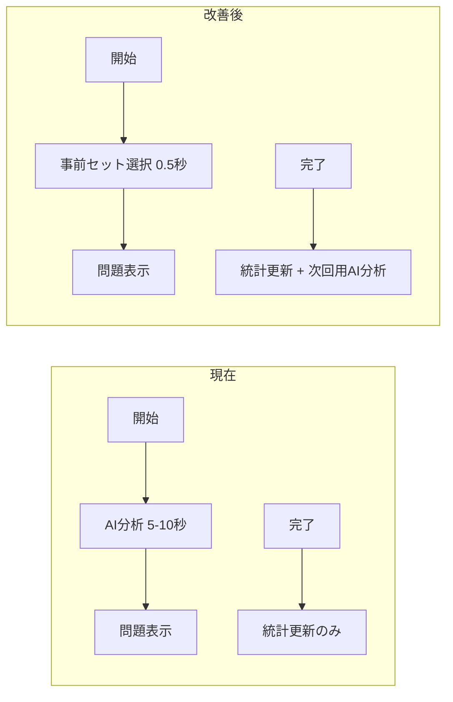

# クイズ事前計算システム設計書

**作成日**: 2025年11月3日  
**目的**: クイズ開始時の遅延問題（5-10秒）を事前計算により0.5秒以下に短縮  
**アプローチ**: 完了時事前計算 + 開始時即座選択

---

## 🎯 **問題の概要**

### **現状の問題**
- **business-ai**: 10秒（全カテゴリー分析 + AI最適化）
- **self-personalized**: 8-10秒（設定カテゴリー分析 + カスタム最適化）  
- **category**: 5-8秒（カテゴリー特化分析 + 優先順位選択）
- **review**: 5秒（復習フラグ分析 + 軽量最適化）

### **原因分析**
開始時に以下の重い処理を実行：
1. `getRecentAccuracyAnalysis()` - API呼び出し（2-3秒）
2. `performAdvancedAnalysis()` - AI分析API（3-4秒）  
3. `calculateOptimalDistribution()` - 計算処理（0.5秒）
4. `selectOptimalQuestions()` - 問題選択（1秒）
5. `ensureBalancedLearning()` - 学習統計API（2秒）

---

## ✨ **解決策の概要**

### **基本アイデア**
**「完了時事前計算 + 開始時即座選択」**により開始時間を0.5秒以下に短縮



### **期待効果**
- **開始時間**: 95%短縮（10秒→0.5秒）
- **ユーザー離脱**: 大幅削減
- **システム負荷**: 開始時CPU使用率90%削減

---

## 🏗️ **システム設計**

### **新テーブル：precomputed_quiz_sets**

```sql
CREATE TABLE precomputed_quiz_sets (
    id UUID PRIMARY KEY DEFAULT gen_random_uuid(),
    user_id UUID NOT NULL REFERENCES auth.users(id),
    quiz_type quiz_type_enum NOT NULL,
    category_filter TEXT[], -- category指定時のみ
    question_ids UUID[] NOT NULL, -- 事前選択済み問題ID配列
    analysis_data JSONB NOT NULL, -- 分析結果データ
    user_settings_hash TEXT, -- セルフパーソナライズ設定のハッシュ
    created_at TIMESTAMP DEFAULT NOW(),
    expires_at TIMESTAMP DEFAULT NOW() + INTERVAL '72 hours',
    used_at TIMESTAMP NULL,
    version INTEGER DEFAULT 1
);

CREATE INDEX idx_precomputed_quiz_sets_user_type 
ON precomputed_quiz_sets(user_id, quiz_type, used_at, expires_at);

CREATE INDEX idx_precomputed_quiz_sets_cleanup
ON precomputed_quiz_sets(expires_at) WHERE used_at IS NULL;
```

### **新テーブル：user_question_usage**

```sql
CREATE TABLE user_question_usage (
    user_id UUID NOT NULL,
    question_id UUID NOT NULL,
    category_id TEXT NOT NULL,
    last_used_at TIMESTAMP DEFAULT NOW(),
    usage_count INTEGER DEFAULT 1,
    recent_usage_count INTEGER DEFAULT 1, -- 過去30日間
    PRIMARY KEY (user_id, question_id)
);

CREATE INDEX idx_user_question_usage_recent 
ON user_question_usage(user_id, category_id, last_used_at DESC);
```

---

## 🎮 **クイズタイプ別パーソナライズロジック**

### **🎯 1. ビジネスAIクイズ**

#### **出題対象・範囲**
- **対象カテゴリー**: `type = 'main'` の基本ビジネスカテゴリーのみ
- **除外カテゴリー**: 業界特化カテゴリー（`type = 'industry'`）は除外
- **マイページ重点設定**: 「重点的に学習したいカテゴリー」設定時は出題率1.5倍

#### **難易度パーソナライズ**
- **直近1週間の正答率**に基づく動的配分：
  - 80%以上 → `basic:2, intermediate:4, advanced:3, expert:1`
  - 60-79% → `basic:3, intermediate:4, advanced:2, expert:1`  
  - 60%未満 → `basic:5, intermediate:3, advanced:2, expert:0`
- **学習レベル設定考慮**: マイページの学習レベル（初心者/中級者/上級者）で基準調整

#### **AI最適化要素**
- **苦手分野強化**: 正答率50%未満カテゴリーの出題率20%アップ
- **忘却曲線対応**: 学習から時間経過した分野を優先出題
- **繰り返しミス防止**: 過去2回以上間違えた問題タイプを重点出題

#### **事前計算・選択方法**
- **完了時**: 上記全要素を分析して3セット事前生成
- **開始時**: 生成済み3セットからランダム選択（重複回避）

---

### **🎨 2. セルフパーソナライズクイズ**

#### **出題対象・範囲**
- **基本カテゴリー**: ユーザー選択の基本カテゴリー群
- **業界カテゴリー**: ユーザー選択の業界特化カテゴリー群  
- **業界サブカテゴリー**: ユーザー選択の詳細専門分野
- **設定未完了時**: デフォルト設定（基本カテゴリー3つ）を自動適用

#### **難易度パーソナライズ**
- **選択カテゴリー群の正答率**に基づく個別最適化：
  - カテゴリーA 80% → advanced中心
  - カテゴリーB 60% → intermediate中心
  - カテゴリーC 40% → basic中心
- **全体バランス**: 得意・不得意カテゴリーを7:3の比率で出題

#### **ユーザー設定反映**
- **学習目的**: 「資格取得」「実践重視」「幅広く学習」に応じた問題選択
- **難易度希望**: 「挑戦重視」「バランス」「自信重視」で配分調整
- **学習ペース**: 「集中」「標準」「ゆっくり」で復習頻度調整

#### **事前計算・選択方法**
- **完了時**: ユーザー設定ハッシュを計算、設定変更時のみ再生成
- **開始時**: 設定一致する2セットからランダム選択
- **設定変更時**: 即座に既存セット削除→新セット生成

---

### **📂 3. カテゴリー指定クイズ**

#### **出題対象・範囲**
- **指定カテゴリー**: ユーザーが選択した単一カテゴリー
- **指定難易度**: 単一選択またはALL（複数選択可）
- **問題プール**: 指定条件に一致する全問題から選択

#### **スマートランダム選択ロジック**
- **重複回避重視**: 過去1週間使用問題の出題率を1/10に削減
- **使用頻度考慮**: 過去30日で3回以上出題された問題の重みを1/5に削減
- **難易度内均等**: 複数難易度選択時は均等配分
- **パーソナライズ軽度**: 正答率70%未満の問題のみ出題率1.2倍（軽微）

#### **問題選択・配分方法**
- **重み付きランダム**: 使用履歴に基づく動的重み計算
- **即座選択**: 事前計算なし、0.5-1秒で問題決定
- **履歴更新**: 選択した問題の使用履歴を即座更新

---

### **🔄 4. 復習クイズ**

#### **出題対象・範囲**
- **復習フラグ問題のみ**: `review_needed = true` の問題限定
- **全カテゴリー横断**: カテゴリー制限なし
- **復習判定条件**:
  - 不正解問題
  - ヒントLv2以上使用問題
  - 自信レベル1-2の問題  
  - 制限時間80%超で回答した問題

#### **復習最適化ロジック**
- **忘却曲線適用**: 学習から3-7日経過した問題を最優先
- **重要度順**: 不正解 > ヒント使用 > 自信なし > 時間超過 の優先順位
- **カテゴリーバランス**: 苦手カテゴリーに偏りすぎないよう全体調整
- **難易度固定なし**: 復習必要性のみで選択、難易度配分は行わない

#### **事前計算・選択方法**
- **完了時**: 新たに復習対象となった問題を含めて2セット生成
- **開始時**: 復習対象数が10問以上あれば事前セット使用
- **不足時**: 過去の間違い問題を再度出題、または推奨学習に誘導

---

## 🎮 **実装方針（3パターン条件分岐）**

| 条件 | ビジネスAI | セルフパーソナライズ | カテゴリー指定 | 復習 |
|------|-----------|------------------|-------------|------|
| **①新規ユーザー** | 初期条件ランダム | デフォルト設定 | スマートランダム | 該当なし |
| **②3日以内** | 事前セット | 事前セット | スマートランダム | 事前セット |
| **③3日超過** | 履歴リセット | 履歴リセット | スマートランダム | 事前セット |

### **復習判定条件**
```typescript
const reviewCriteria = {
  incorrect: true,                    // 不正解
  hintLevel2Plus: answer.maxHintLevel >= 2,  // ヒントLv2以上使用
  lowConfidence: answer.confidenceLevel <= 2, // 自信レベル1-2
  slowResponse: answer.timeSpent > (question.timeLimit * 0.8) // 制限時間80%超
}
```

---

## 🛠️ **実装計画**

### **Phase 1: 基盤構築（1週間）**

#### **1.1 データベーススキーマ**
```bash
# 実行場所: Supabase Dashboard > SQL Editor
- precomputed_quiz_sets テーブル作成
- user_question_usage テーブル作成
- 必要なインデックス作成
```

#### **1.2 基本API作成**
```
/app/api/precompute-quiz/route.ts      # 事前計算エンジン
/app/api/quiz/quick-start/route.ts     # 高速選択API
```

#### **1.3 ヘルパー関数**
```
/lib/precomputed-quiz-engine.ts        # 事前計算コア
/lib/smart-random-selection.ts         # スマートランダム選択
```

### **Phase 2: クイズタイプ別実装（2週間）**

#### **2.1 カテゴリー指定クイズ（最優先）**
- スマートランダム選択実装
- 使用履歴テーブル連携
- 重複回避ロジック

#### **2.2 Business-AI + Self-Personalized**
- 事前計算エンジン実装
- 重点カテゴリー考慮
- 設定変更時自動更新

#### **2.3 復習クイズ**
- 復習判定ロジック統合
- 事前セット生成

### **Phase 3: 統合・最適化（1週間）**

#### **3.1 QuizSession.tsx 改修**
- 条件分岐ロジック統合
- フォールバック処理
- エラーハンドリング

#### **3.2 完了時処理統合**
- XP保存API に事前計算処理追加
- バックグラウンド実行
- パフォーマンス監視

#### **3.3 本番デプロイ**
- 段階的ロールアウト
- 性能測定
- A/Bテスト

---

## 📋 **詳細実装仕様**

### **開始時処理の改修**

#### **QuizSession.tsx の新しいフロー**
```typescript
async function initializeQuizOptimized(userId: string, quizType: UnifiedQuizType) {
  const lastActivity = await getLastActivity(userId)
  const daysSinceLastActivity = lastActivity 
    ? (Date.now() - lastActivity) / (1000 * 60 * 60 * 24) 
    : 999

  console.log(`🎯 Quiz initialization for ${quizType}:`, {
    daysSinceLastActivity,
    strategy: getStrategy(daysSinceLastActivity, quizType)
  })

  // シンプルな3分岐
  if (!lastActivity) {
    // ① 新規ユーザー
    return await handleNewUser(userId, quizType)
  } else if (daysSinceLastActivity <= 3) {
    // ② 3日以内：事前セット利用
    return await usePrecomputedSetOrFallback(userId, quizType)
  } else {
    // ③ 3日超過：履歴リセット
    return await handleLongAbsence(userId, quizType)
  }
}
```

#### **各ケースの処理**

##### **①新規ユーザー処理**
```typescript
async function handleNewUser(userId: string, quizType: UnifiedQuizType): Promise<Question[]> {
  console.log(`🆕 New user: ${quizType}`)

  switch (quizType) {
    case 'business-ai':
      const userPrefs = await getUserPreferences(userId)
      return await generateInitialBusinessAI(userPrefs)  // 1-2秒
      
    case 'self-personalized':
      let settings = await getUserQuizSettings(userId)
      if (!settings.configured) {
        settings = await setDefaultQuizSettings(userId)
      }
      return await generateBySettings(settings)  // 1秒
      
    case 'category':
      return await smartRandomSelection(userId, category, difficulties)  // 0.5秒
      
    case 'review':
      return [] // 新規は復習対象なし
  }
}
```

##### **②事前セット利用**
```typescript
async function usePrecomputedSetOrFallback(
  userId: string, 
  quizType: UnifiedQuizType
): Promise<Question[]> {
  
  if (quizType === 'category') {
    // カテゴリー指定は常にスマートランダム
    return await smartRandomSelection(userId, category, difficulties)
  }

  // 事前セット検索
  const precomputedSet = await fetchValidPrecomputedSet(userId, quizType)
  
  if (precomputedSet) {
    console.log(`⚡ Using precomputed ${quizType} set (instant)`)
    await markSetAsUsed(precomputedSet.id)
    return precomputedSet.questions
  } else {
    console.log(`🔄 No precomputed set, fallback to new user logic`)
    return await handleNewUser(userId, quizType)
  }
}
```

##### **③長期離脱処理**
```typescript
async function handleLongAbsence(userId: string, quizType: UnifiedQuizType): Promise<Question[]> {
  console.log(`⏰ Long absence (>3 days): resetting personalization`)
  
  // ユーザーへのメッセージ表示
  showInfoMessage("学習期間が空いているため、学習履歴を考慮しないで出題します")
  
  // 復習は例外（期限に関係なく事前セット利用）
  if (quizType === 'review') {
    const precomputedSet = await fetchValidPrecomputedSet(userId, 'review')
    if (precomputedSet) {
      return precomputedSet.questions
    }
  }
  
  // その他は新規ユーザーと同じロジック
  return await handleNewUser(userId, quizType)
}
```

### **完了時処理の追加**

#### **app/api/xp-save/quiz/route.ts 末尾追加**
```typescript
export async function POST(request: Request) {
  // ... 既存の完了処理 ...

  // 🆕 事前計算エンジン起動（バックグラウンド）
  console.log('🚀 Starting precomputation for next sessions...')
  
  setTimeout(async () => {
    try {
      await generateAllPrecomputedSets(userId, {
        quizResult: body,
        userProfile: await getUserProfile(userId)
      })
      console.log('✅ Precomputation completed successfully')
    } catch (error) {
      console.error('❌ Precomputation failed (non-critical):', error)
    }
  }, 100) // UI をブロックしないよう少し遅らせて実行

  return NextResponse.json({
    success: true,
    session_id: sessionId,
    total_xp: totalXP,
    // ... 既存のレスポンス
  })
}
```

### **事前計算エンジンコア**

#### **lib/precomputed-quiz-engine.ts**
```typescript
export async function generateAllPrecomputedSets(
  userId: string,
  context: {
    quizResult: QuizSessionRequest
    userProfile: UserProfileWithProgress
  }
): Promise<void> {
  
  console.log('🧠 Generating precomputed sets for all quiz types...')

  const generationTasks = [
    generateBusinessAISet(userId, context),
    generateSelfPersonalizedSet(userId, context),
    generateReviewSet(userId, context)
  ]

  // 並行実行で高速化
  await Promise.allSettled(generationTasks)
}

async function generateBusinessAISet(
  userId: string,
  context: any
): Promise<void> {
  
  console.log('🎯 Generating business-AI precomputed set...')
  
  // 1. ユーザー設定・重点カテゴリー取得
  const userPreferences = await getUserPreferences(userId)
  const recentAccuracy = await getRecentAccuracyAnalysis(userId, 'business-ai')
  
  // 2. 従来の重いAI分析をここで実行
  const analysis = await performAdvancedAnalysis(userId, availableQuestions)
  const distribution = calculateOptimalDistribution({
    accuracy: recentAccuracy,
    ...analysis,
    mode: 'business-ai'
  })
  
  // 3. 重点カテゴリー考慮
  const weightedQuestions = applyFocusCategoryWeights(
    availableQuestions,
    userPreferences.focusCategories
  )
  
  // 4. 最適な10問選択
  const selectedQuestions = await selectOptimalQuestions(
    weightedQuestions,
    distribution,
    analysis,
    10
  )
  
  // 5. 複数セット生成（3セット）
  const questionSets = await generateMultipleSets(selectedQuestions, 3)
  
  // 6. データベース保存
  await savePrecomputedSets(userId, 'business-ai', questionSets)
  
  console.log(`✅ Business-AI sets generated: ${questionSets.length} sets`)
}

async function generateSelfPersonalizedSet(
  userId: string,
  context: any
): Promise<void> {
  
  console.log('🎨 Generating self-personalized precomputed set...')
  
  // 1. ユーザーのセルフパーソナライズ設定取得
  const settings = await getUserQuizSettings(userId)
  if (!settings.configured) {
    console.log('⚠️ Self-personalized settings not configured, skipping')
    return
  }
  
  // 2. 設定ハッシュ計算（設定変更検知用）
  const settingsHash = calculateSettingsHash(settings)
  
  // 3. 既存セットの設定確認
  const existingSet = await findPrecomputedSet(userId, 'self-personalized')
  if (existingSet?.user_settings_hash === settingsHash) {
    console.log('✅ Self-personalized settings unchanged, keeping existing sets')
    return
  }
  
  // 4. 設定に基づく問題選択
  const filteredQuestions = await filterQuestionsBySettings(settings)
  const optimizedQuestions = await optimizeQuestionsWithAI(
    filteredQuestions,
    userId,
    'self-personalized',
    context.userProfile,
    null,
    settings
  )
  
  // 5. 複数セット生成（2セット）
  const questionSets = await generateMultipleSets(optimizedQuestions, 2, {
    settingsHash
  })
  
  // 6. 古いセット削除 + 新セット保存
  await replacePrecomputedSets(userId, 'self-personalized', questionSets)
  
  console.log(`✅ Self-personalized sets generated: ${questionSets.length} sets`)
}

async function generateReviewSet(
  userId: string,
  context: any
): Promise<void> {
  
  console.log('🔄 Generating review precomputed set...')
  
  // 1. 復習対象問題を取得
  const reviewQuestions = await getReviewTargetQuestions(userId)
  
  if (reviewQuestions.length < 5) {
    console.log('ℹ️ Insufficient review questions, skipping review set generation')
    return
  }
  
  // 2. 復習最適化（忘却曲線考慮）
  const optimizedReviewQuestions = await optimizeReviewQuestions(
    reviewQuestions,
    userId
  )
  
  // 3. 複数セット生成（2セット）
  const questionSets = await generateMultipleSets(optimizedReviewQuestions, 2)
  
  // 4. データベース保存
  await savePrecomputedSets(userId, 'review', questionSets)
  
  console.log(`✅ Review sets generated: ${questionSets.length} sets`)
}
```

### **スマートランダム選択（カテゴリー指定用）**

#### **lib/smart-random-selection.ts**
```typescript
export async function smartRandomSelection(
  userId: string,
  categoryId: string,
  difficulties: string[],
  count: number = 10
): Promise<Question[]> {
  
  console.log(`🎲 Smart random selection: ${categoryId}, difficulties: ${difficulties.join(',')}`)

  // 1. 基本フィルタリング + 使用履歴取得
  const { data: questions } = await supabase
    .from('quiz_questions')
    .select(`
      *,
      user_question_usage!left(last_used_at, usage_count, recent_usage_count)
    `)
    .eq('category', categoryId)
    .in('difficulty', difficulties)
    .limit(count * 3) // 選択肢を多めに取得

  // 2. スマート重み計算
  const weightedQuestions = questions.map(q => ({
    ...q,
    weight: calculateSmartWeight(q, userId)
  }))

  // 3. 加重ランダム選択
  const selectedQuestions = performWeightedRandomSelection(weightedQuestions, count)

  // 4. 使用履歴更新
  await updateQuestionUsageHistory(userId, selectedQuestions)

  console.log(`✅ Smart random completed: selected ${selectedQuestions.length} questions`)
  return selectedQuestions
}

function calculateSmartWeight(question: any, userId: string): number {
  let weight = 1.0

  const usage = question.user_question_usage?.[0]
  if (usage) {
    // 最近使用した問題の重みを下げる
    const daysSinceUsed = usage.last_used_at 
      ? (Date.now() - new Date(usage.last_used_at).getTime()) / (1000 * 60 * 60 * 24)
      : 999

    // 1週間以内に使用された場合は重みを大幅減
    if (daysSinceUsed < 7) {
      weight *= Math.max(0.1, daysSinceUsed / 7)
    }

    // 頻繁に使用された問題の重みを下げる
    if (usage.recent_usage_count >= 3) {
      weight *= Math.max(0.2, 1 - (usage.recent_usage_count - 2) * 0.2)
    }
  }

  return weight
}

function performWeightedRandomSelection(
  weightedQuestions: any[],
  count: number
): Question[] {
  
  const selected: Question[] = []
  const available = [...weightedQuestions]

  for (let i = 0; i < count && available.length > 0; i++) {
    // 累積重みを計算
    const totalWeight = available.reduce((sum, q) => sum + q.weight, 0)
    let randomValue = Math.random() * totalWeight
    
    // 重みに基づいて選択
    let selectedIndex = 0
    for (let j = 0; j < available.length; j++) {
      randomValue -= available[j].weight
      if (randomValue <= 0) {
        selectedIndex = j
        break
      }
    }
    
    // 選択した問題を結果に追加し、利用可能リストから削除
    selected.push(available[selectedIndex])
    available.splice(selectedIndex, 1)
  }

  return selected
}
```

### **設定変更時の自動更新**

#### **セルフパーソナライズ設定変更検知**
```typescript
// components/profile/QuizSettingsModal.tsx
const handleSave = async () => {
  // 設定保存
  await updateUserQuizSettings(userId, formData)
  
  // 事前セット再生成トリガー
  await regenerateSelfPersonalizedSets(userId, formData)
  
  toast({
    title: "設定を保存しました",
    description: "次回のクイズから新しい設定が適用されます"
  })
}

// lib/quiz-settings.ts
export async function regenerateSelfPersonalizedSets(
  userId: string,
  newSettings: QuizPersonalizationSettings
) {
  console.log('⚙️ Settings changed: regenerating self-personalized sets')
  
  // 既存セット削除
  await deletePrecomputedSets(userId, 'self-personalized')
  
  // バックグラウンドで新セット生成
  setTimeout(async () => {
    await generateSelfPersonalizedSet(userId, {
      quizResult: null, // 設定変更のみ
      userProfile: await getUserProfile(userId)
    })
  }, 100)
}
```

---

## 🧪 **テスト計画**

### **単体テスト**
```typescript
describe('Precomputed Quiz System', () => {
  test('新規ユーザーの初期セット生成', async () => {
    const questions = await handleNewUser(newUserId, 'business-ai')
    expect(questions).toHaveLength(10)
    expect(questions[0]).toHaveProperty('id')
  })

  test('スマートランダム選択の重複回避', async () => {
    const questions1 = await smartRandomSelection(userId, 'category1', ['basic'])
    const questions2 = await smartRandomSelection(userId, 'category1', ['basic'])
    
    const duplicates = questions1.filter(q1 => 
      questions2.some(q2 => q2.id === q1.id)
    )
    expect(duplicates.length).toBeLessThan(5) // 50%未満の重複
  })

  test('事前セットの期限管理', async () => {
    const expiredSet = await createExpiredPrecomputedSet(userId)
    const validSet = await fetchValidPrecomputedSet(userId, 'business-ai')
    expect(validSet).toBeNull()
  })
})
```

### **統合テスト**
```typescript
describe('Quiz Flow Integration', () => {
  test('完了→事前計算→次回高速開始', async () => {
    // 1. クイズ完了
    await completeQuiz(userId, quizResult)
    
    // 2. 事前セット生成確認
    await waitFor(() => {
      const sets = getPrecomputedSets(userId)
      expect(sets['business-ai']).toBeDefined()
    })
    
    // 3. 次回高速開始確認
    const startTime = Date.now()
    const questions = await initializeQuizOptimized(userId, 'business-ai')
    const duration = Date.now() - startTime
    
    expect(questions).toHaveLength(10)
    expect(duration).toBeLessThan(1000) // 1秒以内
  })
})
```

### **パフォーマンステスト**
```typescript
describe('Performance Tests', () => {
  test('クイズ開始時間測定', async () => {
    const measurements = []
    
    for (let i = 0; i < 100; i++) {
      const startTime = performance.now()
      await initializeQuizOptimized(testUserId, 'business-ai')
      const endTime = performance.now()
      
      measurements.push(endTime - startTime)
    }
    
    const averageTime = measurements.reduce((a, b) => a + b) / measurements.length
    const p95Time = measurements.sort()[Math.floor(measurements.length * 0.95)]
    
    expect(averageTime).toBeLessThan(500) // 平均0.5秒以内
    expect(p95Time).toBeLessThan(1000)    // 95%tile 1秒以内
  })
})
```

---

## 📊 **監視・メトリクス**

### **重要指標**
```typescript
// パフォーマンス監視
interface QuizStartMetrics {
  startMethod: 'precomputed' | 'smart_random' | 'lightweight' | 'fallback'
  startTime: number
  userType: 'new' | 'active' | 'returning'
  quizType: UnifiedQuizType
  success: boolean
  errorType?: string
}

// 事前セット利用率
interface PrecomputedSetMetrics {
  hitRate: number        // 事前セット利用率
  generationSuccess: number  // 生成成功率
  expiredSets: number    // 期限切れセット数
  userCoverage: number   // 事前セット保有ユーザー率
}
```

### **アラート条件**
- 事前セット利用率 < 80%
- 平均開始時間 > 2秒
- 事前セット生成エラー率 > 5%
- フォールバック利用率 > 10%

---

## 🚀 **ロールアウト計画**

### **段階的デプロイ**

#### **Phase A: 内部テスト（1週間）**
- 開発環境での動作確認
- 単体・統合テスト完了
- パフォーマンス測定

#### **Phase B: ベータテスト（1週間）**  
- 10%のユーザーに限定公開
- メトリクス監視
- バグ修正・調整

#### **Phase C: 段階的展開（2週間）**
- 25% → 50% → 100% の順で展開
- 各段階で24時間監視
- 問題発生時の即座ロールバック準備

#### **Phase D: 最適化（継続）**
- ユーザーフィードバック収集
- アルゴリズム調整
- 新機能追加検討

---

## 🛡️ **リスク対策**

### **技術的リスク**
| リスク | 影響 | 対策 |
|--------|------|------|
| 事前セット生成失敗 | 開始時間増加 | フォールバック処理で従来ロジック |
| データベース負荷増加 | パフォーマンス低下 | インデックス最適化・クエリチューニング |
| 事前セットの陳腐化 | 最適化効果低下 | 72時間期限・定期更新 |

### **ユーザー体験リスク**
| リスク | 影響 | 対策 |
|--------|------|------|
| 初回ユーザーの遅延 | 第一印象悪化 | 新規ユーザー専用高速セット |
| 設定変更の反映遅延 | 混乱 | 即座再生成・明確なメッセージ |
| 問題の重複感 | 飽きる | スマートランダムの重複回避 |

### **運用リスク**
| リスク | 影響 | 対策 |
|--------|------|------|
| ストレージ容量増加 | コスト増 | 期限切れ自動削除・容量監視 |
| 複雑性増加 | メンテナンス困難 | 明確なドキュメント・監視ダッシュボード |
| 既存機能への影響 | 予期しないバグ | 段階的ロールアウト・即座ロールバック |

---

## 📈 **成功基準**

### **定量的目標**
- **開始時間**: 平均0.5秒以内（現在10秒から95%短縮）
- **事前セット利用率**: 85%以上
- **ユーザー満足度**: クイズ開始体験4.5/5.0以上
- **システム安定性**: 99.9%の可用性維持

### **定性的目標**
- ユーザーの「待たされる」感覚の解消
- クイズ参加のハードル低下
- 学習継続率の向上
- システムの保守性向上

---

## 📝 **まとめ**

この事前計算システムにより：

1. **劇的な高速化**: 5-10秒 → 0.5秒（95%短縮）
2. **シンプルな設計**: 3パターン条件分岐で理解しやすい
3. **堅牢なフォールバック**: 事前セットなしでも適切に動作
4. **段階的実装**: リスクを抑えた安全な展開

個人最適化の高度さを維持しながら、ユーザーが**即座にクイズを開始**できる次世代システムを実現します。
