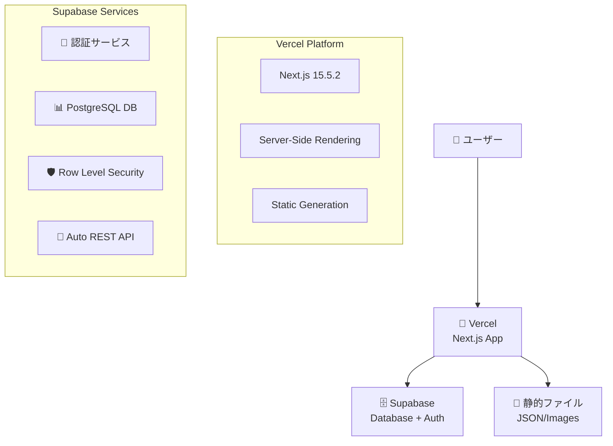
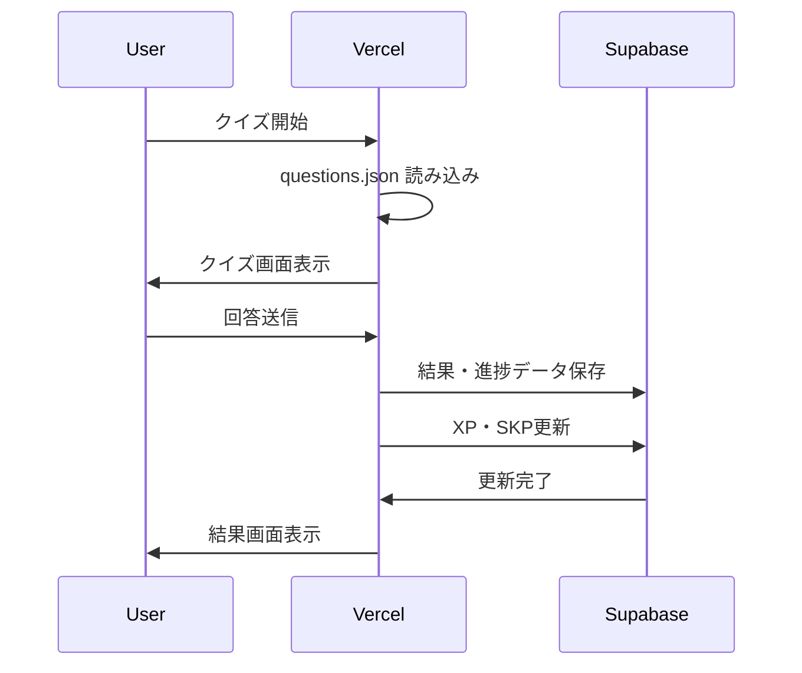
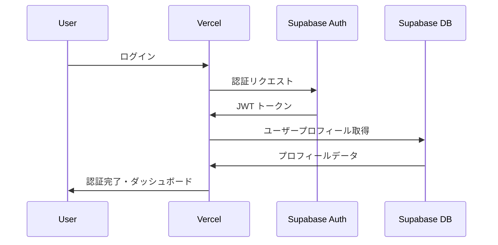

# AI学習プラットフォーム システム構成ドキュメント

## 📋 概要

本ドキュメントは、AI学習プラットフォームの機能・データ・環境構成を整理したものです。

---

## 🏗️ システム全体構成



---

## 🔧 技術スタック

| 領域 | 技術 | バージョン | 役割 |
|------|------|------------|------|
| **フロントエンド** | Next.js | 15.5.2 | React Framework |
| **認証** | Supabase Auth | 2.57.4 | ユーザー認証・セッション管理 |
| **データベース** | PostgreSQL | Supabase | ユーザーデータ・学習進捗 |
| **ホスティング** | Vercel | - | アプリケーション配信 |
| **UI** | Tailwind CSS | 3.x | スタイリング |
| **状態管理** | React Context | - | ユーザー状態・認証状態 |

---

## 🗄️ データ・機能配置

### **🚀 Vercel (フロントエンド・静的リソース)**

#### **アプリケーションコード**
- **Next.js アプリケーション**: `/app`, `/components`, `/lib`
- **ルーティング**: App Router (Next.js 13+)
- **SSR/SSG**: サーバーサイドレンダリング・静的生成

#### **静的データファイル** (`/public/`)
```
📁 public/
├── 📄 questions.json          # クイズ問題データ (232KB, 215問)
├── 📁 learning-data/
│   ├── 📄 courses.json        # 学習コース定義
│   ├── 📄 *.json             # 個別コースデータ
├── 📁 badges/
│   └── 📄 *.svg              # バッジ画像
└── 📄 *.svg                  # アイコン・ロゴ
```

#### **機能範囲**
- ✅ UI/UX レンダリング
- ✅ クライアントサイドロジック
- ✅ 静的コンテンツ配信
- ✅ API ルート処理

---

### **🗄️ Supabase (認証・データベース)**

#### **🔐 認証機能 (Supabase Auth)**
```typescript
// 提供される認証機能
- ユーザー登録・ログイン
- セッション管理
- パスワード認証
- JWT トークン発行・検証
- ユーザー状態管理
```

**実装箇所:**
- `components/auth/AuthProvider.tsx` - 認証コンテキスト
- `lib/supabase.ts` - Supabase クライアント設定
- `app/login/page.tsx` - ログイン画面

#### **📊 データベース (PostgreSQL)**

##### **ユーザー関連テーブル**
```sql
-- 基本ユーザー情報
profiles (
    id: UUID,           -- Supabase Auth連携
    email: TEXT,
    name: TEXT,
    display_name: TEXT,
    industry: TEXT,
    total_xp: INTEGER,
    current_level: INTEGER
)

-- ユーザー設定
user_settings (
    user_id: UUID,
    setting_key: TEXT,
    setting_value: JSONB
)
```

##### **学習データテーブル**
```sql
-- カテゴリー別進捗
category_progress (
    user_id: UUID,
    category_id: TEXT,
    current_level: INTEGER,
    total_xp: INTEGER,
    correct_answers: INTEGER,
    total_answers: INTEGER
)

-- クイズ結果
quiz_results (
    user_id: UUID,
    category_id: TEXT,
    score: INTEGER,
    total_questions: INTEGER,
    time_taken: INTEGER
)

-- 詳細回答データ
detailed_quiz_data (
    user_id: UUID,
    quiz_result_id: UUID,
    question_id: TEXT,
    is_correct: BOOLEAN,
    response_time: INTEGER
)
```

##### **SKP・学習管理テーブル**
```sql
-- SKP取引履歴
skp_transactions (
    user_id: UUID,
    type: TEXT,         -- 'earned' | 'spent'
    amount: INTEGER,
    source: TEXT,
    description: TEXT,
    timestamp: TIMESTAMPTZ
)

-- 学習セッション
learning_sessions (
    user_id: UUID,
    session_id: TEXT,
    start_time: TIMESTAMPTZ,
    duration: INTEGER,
    completed: BOOLEAN
)

-- ユーザーバッジ
user_badges (
    user_id: UUID,
    badge_id: TEXT,
    badge_name: TEXT,
    earned_at: TIMESTAMPTZ
)
```

#### **🛡️ セキュリティ (Row Level Security)**
- **RLS ポリシー**: ユーザーごとのデータアクセス制御
- **認証必須**: 全DBアクセスで認証状態チェック
- **API 自動生成**: Supabaseが REST API を自動提供

---

## 🌍 環境構成

### **🛠️ 開発環境**

#### **ローカル開発**
```bash
# 開発サーバー起動
npm run dev

# 環境変数 (.env.local)
NEXT_PUBLIC_SUPABASE_URL=https://bddqkmnbbvllpvsynklr.supabase.co
NEXT_PUBLIC_SUPABASE_ANON_KEY=eyJhbGciOi...
```

**特徴:**
- ✅ ホットリロード対応
- ✅ Turbopack高速ビルド
- ✅ 本番Supabaseインスタンス接続
- ✅ リアルタイムデバッグ

#### **データソース (開発時)**
- **静的データ**: ローカル `/public/*.json`
- **ユーザーデータ**: Supabase (本番インスタンス)
- **認証**: Supabase Auth (本番インスタンス)

---

### **🚀 本番環境**

#### **Vercel デプロイ**
```bash
# 自動デプロイフロー
git push origin main → GitHub → Vercel Webhook → Auto Deploy
```

**特徴:**
- ✅ **継続的デプロイ**: GitHubプッシュで自動デプロイ
- ✅ **CDN配信**: 静的ファイルのグローバル配信
- ✅ **サーバーレス**: Next.js API Routes
- ✅ **環境変数管理**: Vercel Dashboard

#### **データソース (本番)**
- **静的データ**: Vercel CDN (`/public/*.json`)
- **ユーザーデータ**: Supabase (本番インスタンス)
- **認証**: Supabase Auth (本番インスタンス)

---

## 🔄 データフロー

### **クイズ実行フロー**


### **認証フロー**


---

## 📈 XP/SKP システム

### **データ処理方式**

#### **チャレンジクイズ**
1. **即座計算**: フロントエンドでXP/SKP算出
2. **遅延更新**: 完了画面表示後にDB更新
3. **サブカテゴリー別**: 各問題のサブカテゴリーにXP蓄積

#### **カテゴリー指定クイズ**
- **メインカテゴリー**: 従来方式（カテゴリー単位）
- **業界カテゴリー**: サブカテゴリー別蓄積

#### **プロフィール表示**
- **メインカテゴリー**: 所属サブカテゴリーXP合計
- **業界カテゴリー**: 所属サブカテゴリーXP合計

---

## 🔒 セキュリティ・認証

### **Supabase認証の役割**
- ✅ **ユーザー登録・ログイン**
- ✅ **セッション管理**: JWT-based
- ✅ **パスワードハッシュ化**
- ✅ **API認証**: 全DB操作で認証チェック
- ✅ **RLS適用**: ユーザー単位でデータアクセス制御

### **フロントエンド認証**
```typescript
// AuthProvider.tsx で管理
- ユーザー状態: React Context
- セッション維持: Supabase SDK
- ルートガード: useAuth() hook
- 自動リダイレクト: 未認証時
```

---

## 🚧 デプロイメント

### **自動デプロイパイプライン**
```
1. 開発 → git commit → git push origin main
2. GitHub → Webhook → Vercel
3. Vercel → Build → Test → Deploy
4. 本番環境更新完了 (数分)
```

### **デプロイ対象**
- ✅ **アプリケーションコード**: Next.js
- ✅ **静的JSONファイル**: 問題・コースデータ
- ✅ **画像・アイコン**: SVG/PNG ファイル
- ✅ **環境設定**: ビルド設定

### **デプロイ対象外**
- ❌ **Supabaseデータベース**: 独立サービス
- ❌ **ユーザーデータ**: 既存データ保持
- ❌ **認証設定**: Supabase側で管理

---

## 📊 監視・メンテナンス

### **Vercel**
- デプロイステータス監視
- アクセス解析
- パフォーマンス監視

### **Supabase**
- データベース監視
- 認証ログ
- API使用量監視

---

## 📝 まとめ

**現在の構成の特徴:**

1. **🔄 完全自動化**: コード変更→デプロイまで自動
2. **🏗️ マイクロサービス**: Vercel(アプリ) + Supabase(データ)分離
3. **🛡️ セキュア**: 認証・DB・API すべてSupabase管理
4. **⚡ 高パフォーマンス**: CDN + サーバーレス
5. **🔧 開発効率**: 本番と同じ環境で開発可能

この構成により、機能追加やデータ更新が簡単に本番反映される、非常に効率的な開発・運用環境が実現されています。

---

*最終更新: 2025年9月18日*