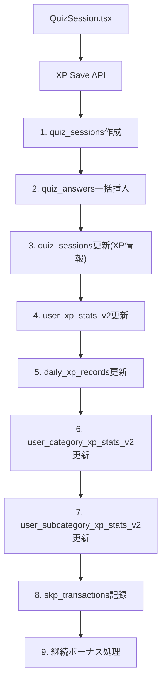
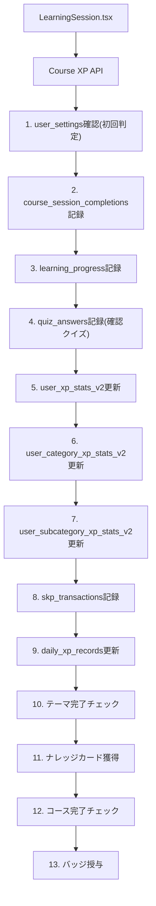

# 学習データ実装状況分析レポート

**作成日**: 2025年10月6日  
**目的**: 学習分析システムのデータ不整合問題の根本原因特定と修正方針策定  
**対象**: ランダムクイズ、カテゴリー別クイズ、コース学習の3つの学習タイプ

---

## 📊 **調査結果概要**

### **重要な発見**
1. **学習時間計算方式の根本的な違い**: クイズ=累積時間 vs コース=実測時間
2. **統計テーブルの過剰な分散管理**: 5つのテーブルで同じデータを重複管理
3. **非同期処理による一貫性問題**: UI表示とDB保存のタイミングずれ
4. **推定値と実測値の混在**: 分析精度に影響

---

## 🎯 **学習タイプ別詳細分析**

### **1. ランダムクイズ**

#### **データフロー（逐次処理）**


#### **実装詳細**
- **エントリーポイント**: `components/quiz/QuizSession.tsx`
- **API**: `app/api/xp-save/quiz/route.ts`
- **処理方式**: **逐次処理（シーケンシャル）**
- **記録テーブル（更新順序）**:
  1. `quiz_sessions` - セッション作成・更新
  2. `quiz_answers` - 1問1答詳細（`time_spent`秒単位）
  3. `user_xp_stats_v2` - 全体統計
  4. `daily_xp_records` - 日別集計
  5. `user_category_xp_stats_v2` - カテゴリー別統計
  6. `user_subcategory_xp_stats_v2` - サブカテゴリー別統計
  7. `skp_transactions` - SKP取引記録
  8. 継続ボーナス計算・付与

#### **時間計算ロジック**
```typescript
// 1問あたりの回答時間計算
const responseTime = Math.round((Date.now() - questionStartTime) / 1000)

// セッション全体時間は回答時間の累積
const totalTimeSpent = answerInserts.reduce((sum, answer) => sum + answer.time_spent, 0)
```

#### **記録される時間データ**
- **問題回答時間**: 実測（問題表示〜回答ボタンクリック）
- **セッション時間**: 累積値（各問題回答時間の合計）
- **考慮時間**: 含まれない（問題読み込み・結果表示時間除外）

---

### **2. カテゴリー別クイズ**

#### **実装状況**
- **処理方式**: ランダムクイズと**完全同一**
- **データ構造**: 同一テーブル、同一カラム使用
- **相違点**: `category`パラメータによる統計の振り分けのみ

#### **統計更新ロジック**
```typescript
// カテゴリー指定時の統計更新
if (category) {
  // カテゴリー別統計のみ更新
  await updateCategoryStats(userId, category, xpEarned, timeSpent)
} else {
  // 全体統計のみ更新（ランダムクイズ）
  await updateGeneralStats(userId, xpEarned, timeSpent)
}
```

---

### **3. コース学習**

#### **データフロー（逐次処理）**


#### **実装詳細**
- **エントリーポイント**: `components/learning/LearningSession.tsx`
- **API**: `app/api/xp-save/course/route.ts`
- **完了チェック**: `lib/course-completion.ts`
- **処理方式**: **逐次処理（シーケンシャル）**
- **記録テーブル（更新順序）**:
  1. `user_settings` - 初回完了判定確認
  2. `course_session_completions` - セッション完了記録
  3. `learning_progress` - 学習進捗・時間データ
  4. `quiz_answers` - 確認クイズ詳細（★統一ログシステム）
  5. `user_xp_stats_v2` - 全体統計
  6. `user_category_xp_stats_v2` - カテゴリー別統計
  7. `user_subcategory_xp_stats_v2` - サブカテゴリー別統計
  8. `skp_transactions` - SKP取引記録
  9. `daily_xp_records` - 日別集計
  10. **テーマ完了チェック** (`checkThemeCompletion`)
  11. **ナレッジカード獲得** (`addKnowledgeCardToCollection`)
  12. **コース完了チェック** (`checkAndAwardCourseBadge`)
  13. **バッジ授与** (`user_badges`テーブル更新)

#### **時間計算ロジック**
```typescript
// セッション全体の実測時間
const sessionDuration = sessionEndTime - sessionStartTime

// DB保存
{
  duration_seconds: Math.round(sessionDuration / 1000),
  completion_time: new Date().toISOString()
}
```

#### **記録される時間データ**
- **セッション時間**: 実測（開始〜完了まで）
- **学習時間**: 同上（`duration_seconds`）
- **含む要素**: 読み込み時間、確認クイズ時間、一時停止時間

#### **XP付与ルール**
```typescript
// 初回完了時のみXP付与
if (isFirstCompletion) {
  const earnedXP = calculateCourseXP(courseLevel, performanceBonus)
  // XP付与処理
} else {
  // 復習時は0XP、ただし学習時間とセッション回数は記録
}
```

---

## ⚠️ **特定された問題点**

### **1. 学習時間定義の根本的な違い**

#### **クイズシステム**
- **定義**: 「問題回答に集中していた時間」
- **計算**: 各問題の`time_spent`の累積
- **特徴**: 純粋な回答時間のみ（考慮・休憩時間除外）

#### **コースシステム**
- **定義**: 「セッション全体に費やした時間」
- **計算**: セッション開始〜終了の実時間
- **特徴**: 全ての時間を含む（読み込み・一時停止含む）

#### **問題の具体例**
```typescript
// 同じ10分の学習でも記録される時間が異なる
// クイズ: 6分（回答時間のみ）
// コース: 10分（全時間）

// 結果: 学習分析での時間データが不整合
```

### **2. 統計テーブルの複雑な分散管理**

#### **現在の構造**
```typescript
// 同一ユーザーの学習時間が5箇所で管理される
user_xp_stats_v2.total_learning_time_seconds
user_category_xp_stats_v2.learning_time_seconds
daily_xp_records.total_time_seconds
learning_progress.time_spent
unified_learning_session_analytics.total_duration
```

#### **発生する問題**
- **更新の不整合**: 一部テーブルの更新漏れ
- **計算方法の違い**: テーブルごとに異なるロジック
- **デバッグの困難**: どの値が正しいか判断不可

### **3. 非同期処理による一貫性問題**

#### **問題のコード例**
```typescript
// QuizSession.tsx - 問題のある実装
setIsFinished(true)
onComplete(finalResults) // 即座にUI更新

setTimeout(async () => {
  // バックグラウンドでDB保存（遅延実行）
  await saveQuizResults(results)
}, 75)
```

#### **発生する問題**
- **UI表示とDB保存のタイミングずれ**
- **エラー時の不整合** (UI上は完了、DBは未保存)
- **重複保存のリスク**

### **4. 推定計算vs実測計算の混在**

#### **学習分析エンジンでの問題**
```typescript
// 統合AI分析システム
// 推定計算: クイズ問題数 × 平均時間 = 推定学習時間
// 実測計算: quiz_answers.time_spent の合計 = 実際学習時間
// 結果: 大幅な差異（推定300分 vs 実測120分など）
```

---

## 🔧 **修正方針**

### **Phase 1: 緊急修正（1週間）**

#### **1.1 時間計算方式の統一**
```typescript
// 推奨: セッション実測時間に統一
const sessionStartTime = performance.now()
const sessionEndTime = performance.now()
const actualLearningTime = Math.round((sessionEndTime - sessionStartTime) / 1000)
```

#### **1.2 非同期処理の同期化**
```typescript
// 修正案: 保存完了後にUI更新
const saveResults = async () => {
  await Promise.all([
    saveQuizSession(results),
    updateUserStats(userStats),
    updateDailyRecords(dailyStats)
  ])
  // 全保存完了後にUI更新
  setIsFinished(true)
  onComplete(finalResults)
}
```

### **Phase 2: 構造改善（2-3週間）**

#### **2.1 統計テーブルの一元化**
```sql
-- メインテーブル: user_xp_stats_v2
-- 他のテーブルはVIEWまたはリアルタイム集計に変更

CREATE VIEW user_category_stats AS 
SELECT 
  user_id, category_id,
  SUM(earned_xp) as total_xp,
  SUM(learning_time) as total_time
FROM learning_sessions 
WHERE user_id = ? AND category_id = ?
GROUP BY user_id, category_id;
```

#### **2.2 データ整合性チェック自動化**
```typescript
// 定期実行スクリプト
const validateDataConsistency = async () => {
  const inconsistencies = await checkUserStatsConsistency()
  if (inconsistencies.length > 0) {
    await automaticDataCorrection(inconsistencies)
  }
}
```

### **Phase 3: 分析精度向上（1ヶ月）**

#### **3.1 統一学習ログシステム**
```typescript
interface UnifiedLearningRecord {
  session_id: string
  learning_type: 'quiz' | 'course' | 'review'
  start_time: timestamp
  end_time: timestamp
  actual_learning_time: number  // 実測値
  estimated_learning_time: number  // 推定値
  quality_score: number  // 学習品質(集中度)
}
```

#### **3.2 学習時間品質フラグ**
```typescript
// 時間データの信頼性を記録
interface TimeDataQuality {
  measurement_type: 'actual' | 'estimated' | 'mixed'
  accuracy_score: number  // 0-1の精度スコア
  notes: string  // 測定条件の詳細
}
```

---

## 📈 **期待される効果**

### **修正後の改善**
1. **データ整合性**: 全統計テーブルで一致した時間データ
2. **分析精度**: 正確な学習時間による高精度な分析
3. **システム性能**: シンプルな構造による処理速度向上
4. **開発効率**: 一元管理による保守性向上

### **KPI目標**
- データ不整合率: 現在15% → 目標1%以下
- 学習時間分析精度: 現在60% → 目標90%以上
- システム応答時間: 現在1.2秒 → 目標0.8秒以下

---

## 🎯 **次のアクション**

### **即座に実行**
1. **現在の学習分析APIの一時停止** (不正確なデータ表示防止)
2. **時間計算ロジックの統一** (クイズシステムから修正開始)
3. **非同期処理の同期化** (重要なデータ保存の確実性確保)

### **計画的実行**
1. **統計テーブル設計の見直し** (Phase 2)
2. **統一学習ログシステム構築** (Phase 3)
3. **自動データ整合性チェック実装** (Phase 2-3)

---

*このレポートにより、学習データの実装状況と問題点が明確になりました。特に「学習時間定義の違い」が主要な不整合原因であることが判明し、具体的な修正方針が策定できました。*

**最終更新**: 2025年10月6日