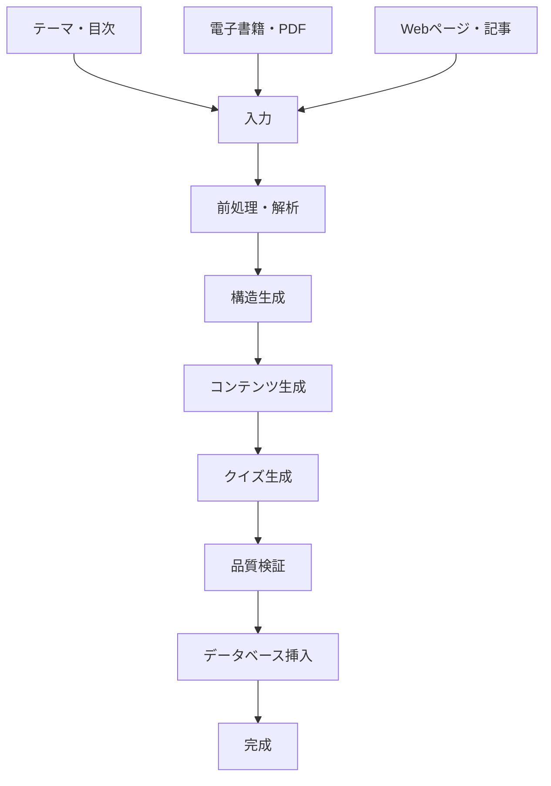

# コース学習データ生成ワークフロー

## 今回の手動作成プロセスの振り返り

### 作成手順

1. **要件分析** (5分)
   - ユーザーからの詳細カリキュラム受領
   - 5テーマ×3セッション構成の確認

2. **データ構造設計** (10分)
   - 階層構造の理解: `learning_courses` → `learning_genres` → `learning_themes` → `learning_sessions` → (`session_contents` + `session_quizzes`)
   - JSONスキーマ設計

3. **基本データ作成** (15分)
   - コース、ジャンル、テーマ、セッションの基本情報
   - SQL INSERT文の作成

4. **制約エラー修正** (20分)
   - `status`: 'available' (not 'active')
   - `session_type`: 'knowledge', 'practice', 'case_study'
   - `content_type`: 'text', 'key_points', 'example'

5. **コンテンツ作成** (60分)
   - 15セッション × 2-3コンテンツ = 36件
   - セッション × 1クイズ = 15件
   - 実務的で具体的なコンテンツ生成

6. **データ品質修正** (10分)
   - JSON.parse エラー対応
   - optionsフィールドの適切なJSON形式確保

**総所要時間**: 約120分

### 作成ポイント・注意事項

#### ✅ 成功要因
- **段階的アプローチ**: 構造 → 基本データ → 詳細コンテンツ
- **制約の事前確認**: 既存データから有効値を学習
- **実務性重視**: 現場で使える具体的な内容
- **エラーハンドリング**: JSON parse失敗時のフォールバック

#### ⚠️ 注意点
- **DB制約の把握**: enum値や外部キー制約
- **ID命名規則**: 一貫性のある命名（snake_case）
- **JSONデータ整合性**: 特にクイズのoptions配列
- **関連データの整合性**: display_orderの重複回避

---

## 生成AI活用コース作成システム実装案

### システム概要



### 入力パターン別実装

#### パターン1: テーマ・目次ベース
```typescript
interface ThemeBasedInput {
  courseTitle: string
  courseDescription: string
  difficulty: 'beginner' | 'intermediate' | 'advanced'
  estimatedDays: number
  themes: {
    title: string
    description: string
    estimatedMinutes: number
    sessions: {
      title: string
      type: 'knowledge' | 'practice' | 'case_study'
      outline?: string
    }[]
  }[]
}
```

#### パターン2: ファイル・コンテンツベース
```typescript
interface ContentBasedInput {
  sourceFile: File | string // PDF, DOCX, MD, HTML
  courseTitle?: string
  targetDifficulty: 'beginner' | 'intermediate' | 'advanced'
  sessionCount?: number
  learningObjectives?: string[]
  targetAudience?: string
}
```

### 実装アーキテクチャ

#### 1. コース構造生成API
```typescript
// /api/course-generation/structure
export async function POST(request: NextRequest) {
  const input = await request.json()
  
  // AIプロンプトでコース構造を生成
  const structure = await generateCourseStructure(input)
  
  // バリデーション
  const validated = validateCourseStructure(structure)
  
  return NextResponse.json(validated)
}
```

#### 2. コンテンツ生成API
```typescript
// /api/course-generation/content
export async function POST(request: NextRequest) {
  const { courseStructure, sourceContent } = await request.json()
  
  const contents = await Promise.all(
    courseStructure.sessions.map(session => 
      generateSessionContent(session, sourceContent)
    )
  )
  
  return NextResponse.json(contents)
}
```

#### 3. クイズ生成API
```typescript
// /api/course-generation/quiz
export async function POST(request: NextRequest) {
  const { sessionContents } = await request.json()
  
  const quizzes = await Promise.all(
    sessionContents.map(content => 
      generateQuizFromContent(content)
    )
  )
  
  return NextResponse.json(quizzes)
}
```

### 生成AI プロンプト設計

#### コース構造生成プロンプト
```typescript
const COURSE_STRUCTURE_PROMPT = `
あなたは教育設計の専門家です。以下の情報を基に、学習効果の高いコース構造を設計してください。

入力情報：
- コースタイトル: {courseTitle}
- 対象レベル: {difficulty}
- 推定学習期間: {estimatedDays}日
- テーマ概要: {themes}

出力要件：
1. 5つ以下のテーマに分割
2. 各テーマは3-4セッションに分割
3. セッションタイプは knowledge/practice/case_study を適切に配分
4. 学習進度が段階的になるよう配慮

出力形式：JSON形式で以下の構造
{JSON_SCHEMA}
`
```

#### コンテンツ生成プロンプト
```typescript
const CONTENT_GENERATION_PROMPT = `
あなたは実務経験豊富な講師です。以下のセッション情報を基に、実践的な学習コンテンツを作成してください。

セッション情報：
- タイトル: {sessionTitle}
- タイプ: {sessionType}
- 学習目標: {learningObjectives}
- 参考資料: {sourceContent}

出力要件：
1. 理論説明 (text): 基本概念の分かりやすい説明
2. 重要ポイント (key_points): 箇条書きでの要点整理
3. 実例・ケース (example): 具体的な業務シーンでの活用例

各コンテンツは500-800文字程度、実務で即活用できる内容にしてください。
`
```

#### クイズ生成プロンプト
```typescript
const QUIZ_GENERATION_PROMPT = `
学習コンテンツを基に、理解度確認のための4択クイズを作成してください。

コンテンツ：
{sessionContent}

要件：
1. セッション内容の重要な概念を問う問題
2. 選択肢は紛らわしいが明確に正解が分かるもの
3. 解説は正解の根拠と他選択肢が不正解な理由を含む
4. 実務での応用を意識した出題

出力形式：
{
  "question": "問題文",
  "options": ["選択肢1", "選択肢2", "選択肢3", "選択肢4"],
  "correct_answer": 0,
  "explanation": "詳細な解説"
}
`
```

### 品質保証・バリデーション

#### 1. 構造バリデーション
```typescript
function validateCourseStructure(structure: CourseStructure): ValidationResult {
  const errors: string[] = []
  
  // 必須フィールドチェック
  if (!structure.title) errors.push('コースタイトルが必要です')
  
  // テーマ数制限
  if (structure.themes.length > 5) {
    errors.push('テーマは5個以下にしてください')
  }
  
  // セッション数制限
  structure.themes.forEach((theme, i) => {
    if (theme.sessions.length > 5) {
      errors.push(`テーマ${i+1}のセッション数が上限を超えています`)
    }
  })
  
  // ID重複チェック
  const allIds = extractAllIds(structure)
  const duplicates = findDuplicates(allIds)
  if (duplicates.length > 0) {
    errors.push(`重複ID: ${duplicates.join(', ')}`)
  }
  
  return { valid: errors.length === 0, errors }
}
```

#### 2. コンテンツ品質チェック
```typescript
function validateContent(content: SessionContent): ContentValidation {
  const issues: string[] = []
  
  // 文字数チェック
  if (content.content.length < 300) {
    issues.push('コンテンツが短すぎます (最低300文字)')
  }
  
  // 専門用語説明チェック
  const technicalTerms = extractTechnicalTerms(content.content)
  const unexplained = findUnexplainedTerms(technicalTerms, content.content)
  if (unexplained.length > 0) {
    issues.push(`説明が必要な用語: ${unexplained.join(', ')}`)
  }
  
  return { score: calculateReadabilityScore(content.content), issues }
}
```

### データベース統合

#### 自動挿入機能
```typescript
// /api/course-generation/deploy
export async function POST(request: NextRequest) {
  const { courseData, options } = await request.json()
  
  try {
    // トランザクション開始
    const result = await supabaseAdmin.rpc('insert_complete_course', {
      course_data: courseData
    })
    
    // 完了通知
    await notifySlack(`新コース「${courseData.title}」が生成されました`)
    
    return NextResponse.json({ 
      success: true, 
      courseId: result.course_id,
      message: 'コースが正常に作成されました'
    })
  } catch (error) {
    return NextResponse.json({ 
      success: false, 
      error: error.message 
    }, { status: 500 })
  }
}
```

### UI/UXフロー

#### 1. 段階的生成画面
```typescript
const CourseGenerationWizard = () => {
  const [step, setStep] = useState<'input' | 'structure' | 'content' | 'quiz' | 'review'>('input')
  const [courseData, setCourseData] = useState<CourseData>()
  
  return (
    <div className="max-w-4xl mx-auto p-6">
      <ProgressBar step={step} />
      
      {step === 'input' && <InputStep onNext={handleStructureGeneration} />}
      {step === 'structure' && <StructureReview onNext={handleContentGeneration} />}
      {step === 'content' && <ContentReview onNext={handleQuizGeneration} />}
      {step === 'quiz' && <QuizReview onNext={handleFinalReview} />}
      {step === 'review' && <FinalReview onDeploy={handleDeploy} />}
    </div>
  )
}
```

#### 2. リアルタイム進捗表示
```typescript
const GenerationProgress = ({ stage }: { stage: GenerationStage }) => {
  return (
    <div className="space-y-4">
      <div className="flex items-center space-x-2">
        <Loader2 className="animate-spin" />
        <span>{stage.message}</span>
      </div>
      <Progress value={stage.progress} />
      <div className="text-sm text-gray-600">
        推定残り時間: {stage.estimatedTime}
      </div>
    </div>
  )
}
```

### 運用・改善サイクル

#### 1. 品質メトリクス
- 生成時間: 目標15分以内
- コンテンツ品質スコア: 目標80点以上
- ユーザー満足度: 目標4.0/5.0以上

#### 2. 継続改善
- 生成結果のユーザーフィードバック収集
- プロンプトの定期的な最適化
- 成功パターンのテンプレート化

### 実装優先度

#### フェーズ1 (MVP)
- [x] 手動作成ワークフローの確立
- [ ] テーマベース構造生成API
- [ ] 基本的なコンテンツ生成機能

#### フェーズ2 (拡張)
- [ ] ファイルアップロード対応
- [ ] 高度な品質検証機能
- [ ] バッチ生成機能

#### フェーズ3 (最適化)
- [ ] ユーザーフィードバック統合
- [ ] AI学習データ蓄積
- [ ] パーソナライズ生成

---

## 付録：既存システム制約

### データベーステーブル制約
```sql
-- status制約
CHECK (status IN ('available', 'coming_soon', 'draft'))

-- session_type制約  
CHECK (session_type IN ('knowledge', 'practice', 'case_study'))

-- content_type制約
CHECK (content_type IN ('text', 'key_points', 'example'))

-- quiz_type制約
CHECK (quiz_type IN ('multiple_choice', 'true_false', 'short_answer'))
```

### ID命名規則
- コース: `{topic}_course` (例: `finance_basics_course`)
- ジャンル: `{topic}_genre` (例: `finance_basics_genre`)  
- テーマ: `{topic}_theme_{number}` (例: `finance_theme_1`)
- セッション: `{topic}_session_{theme}_{number}` (例: `finance_session_1_1`)